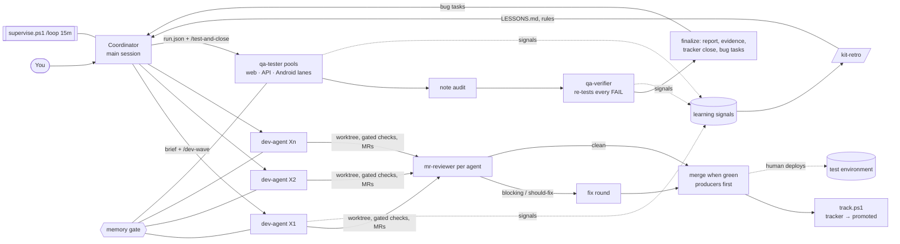

# claude-crew

**A multi-agent dev + QA crew for Claude Code: run a dozen agents on one machine that build, review, merge, test and fix in a loop, without running out of memory or stepping on each other, and that get better every run.**

`claude-crew` is a drop-in `.claude` folder (agents, skills, rules, workflows, hooks) that follows the
[official Claude Code layout](https://code.claude.com/docs/en/claude-directory). Put it in your workspace and Claude Code
can coordinate parallel dev agents and evidence-grade QA agents across any number of repos and stacks.

---

## Problems it solves

| Problem | What claude-crew does |
|---|---|
| **Ten agents on one laptop = out of memory.** Six parallel Maven builds once took a workstation to 100% RAM. | A **machine-wide memory gate** (`gate.ps1`) queues every heavy build/test fairly, learns each project's real peak memory, and sizes JVM/Node/Gradle heaps to fit. A guard hook blocks builds that bypass it. |
| **Agents collide**: the same worktree, a shared `git stash`, skipped hooks, two copies of one agent. | Per-agent **git worktrees** with linked dependencies (`wt.ps1`), an **agent board** (claims, duplicates, heartbeats), hook-safe commits, and a guard that blocks `git stash`, `--no-verify` and force-pushes to shared branches. |
| **Agent output isn't shippable**: no review, wrong merge order, statuses nobody updates. | `/dev-wave`: build → **independent MR review** → fix round → merge-when-green (producers before consumers) → tracker statuses moved automatically when every MR has merged. |
| **"Tested, works" without proof, and defects hidden in notes.** | `/test-and-close`: testers return a verdict per check with **screenshots and request/response JSON**, a **note audit** turns hidden defects into FAILs, every FAIL is **re-tested independently**, then results are published as a report and bug tasks are raised. |
| **The same mistakes, every wave.** | Every agent records **learning signals**; each workflow ends with a Learn step; `/kit-retro` turns recurring signals into `LESSONS.md` lines and rules. The coordinator fixes the kit itself, not just the symptom. |
| **Mobile QA needs phones, and emulators eat RAM.** | An **Android emulator swarm** with phone **leases**: agents acquire a lane, it boots when memory allows, installs the current APK, and is released and shut down when they're done. |

## Features

### Agents (`.claude/agents/`)
| Agent | Role |
|---|---|
| `dev-agent` | Implements one area in its own worktree, runs gated checks, commits with hooks, opens MRs/PRs, updates the tracker |
| `mr-reviewer` | Read-only reviewer of another agent's MRs: real bugs, regressions, breaking API/DB changes, missing rollbacks, scope creep |
| `qa-tester` | Executes one tester guide (web, API or Android lane) on a test environment and returns honest verdicts with evidence |
| `qa-verifier` | Skeptical second opinion: re-tests every FAIL from scratch and audits PASS_WITH_NOTE for hidden defects |

### Workflows (`.claude/workflows/`)
| Command | What it runs |
|---|---|
| `/dev-wave` | One dev agent per area in parallel → independent review per agent → CI gate (MR pipelines checked before merge; failed jobs become blocking findings) → one fix round for blocking/should-fix findings → merges scheduled after a clean review and green pipelines → Learn step |
| `/test-and-close` | Web pool + API pool + one agent per Android lane → retest if > 25% NOT_TESTED → note audit → independent verify of every FAIL → publish (report as a Google Doc or Markdown + tracker comment/close + bug task) → Learn step |
| `/kit-retro` | 4 parallel analysts (dev, QA, speed, docs) mine signals, guard blocks, gate history and QA runs → one maintainer applies lesson/rule changes and lists script changes for approval |

### Skills (`.claude/skills/`)
- **dev-kit** — rules for parallel dev agents plus tools:
  `stack.ps1` (detects Maven, Gradle/Android, .NET SDK/MSBuild, Angular, Node/React/Next/React Native, Python, Go, Rust, CMake, Make),
  `check.ps1` (compile + typecheck + lint / targeted tests / Liquibase checks, incremental `tsc`, through the gate),
  `gate.ps1` (memory gate: fair queue per owner, learned per-project peaks, dynamic heap caps, backfilling),
  `wt.ps1` (worktrees with linked `node_modules`/`.venv` (junctions on Windows, symlinks elsewhere), rebase, hook-safe commits, safe removal),
  `guard.ps1` (PreToolUse guard), `tracker.ps1` (one issue-tracker adapter: ClickUp, GitHub issues, GitLab issues, Jira or none; `-DryRun`),
  `devtools.py` (MR/PR create, merge-when-green on GitLab/GitHub, tracker comments/statuses, tester-guide publishing as a Google Doc or file),
  `pipe-wait.ps1` (waits for MR pipelines; JSON with the failed job and error tail), `lbcheck.py` (Liquibase replay: duplicate columns/tables, missing rollbacks, empty rollbacks on changeSets marked irreversible), `keepboth.py` (append-only conflict resolver), `kitconfig.ps1`.
- **orchestrate** — the coordinator playbook and templates (wave / bug-fix / resume briefs, MR body, task solution), plus
  `supervise.ps1` (heartbeat with ACT/WATCH flags and `-AutoFix`), `board.ps1` (agent board), `track.ps1` (moves tracker tasks when all MRs merge; ordered merges),
  `bug-brief.ps1` (QA bug task → bug-fix brief + tracking + ready /dev-wave args, with a model suggestion),
  `wave-report.ps1` (journal-based wave summary), `status.ps1` (HTML dashboard), `cleanup.ps1` (self-cleaning), `learn.ps1` and `retro-nudge.ps1` (self-improvement).
- **qa-kit** — QA rules (verdicts, shared-environment etiquette), the **evidence standard**, a tester-guide template, and tools:
  `api.ps1` (any API as any configured user; evidence envelopes with secrets redacted), `web/browser.mjs` (long-lived logged-in headless Chrome sessions via puppeteer-core, shared logins, failure capture, element highlighting),
  `android/ui.ps1` (uiautomator-based tap/type/dump/shot/shotmark/wait/log/photo), `annotate.ps1` (box / arrow / label on any screenshot), `finalize.ps1` + `lib/report.ps1` (styled results report → Google Doc or Markdown, tracker comments, bug tasks), `autoclose.ps1` (safety net),
  `qa-seat.ps1` (memory seats + item claims: QA concurrency follows free RAM, extra worker runs never test the same item).
- **android-swarm** — parallel emulators for any APK (React Native or native): `phone.ps1` leases, `app-build.ps1` (through the gate, from the latest merged branch),
  `swarm-up/-down/-slim/-arrange`, `app-mode`/`app-launch` (Release or Metro), `swarm-avd.ps1` (create all lanes from one template; reset cold/snapshots/wipe/recreate).
- **tech-audit** — static audit of one module for bugs, performance and tech debt with strict false-positive discipline; fixed 23-key findings schema, validator and styled summary.

### Rules and hooks
- `rules/multi-agent.md` (always loaded) and `rules/db-migrations.md` (loads when a migration file is opened).
- `settings.json`: PreToolUse guard, SessionStart retro nudge and daily cleanup, a conservative permission allowlist, `git stash` denied.

## How it works



- **One machine, many agents.** Every heavy command goes through the gate. A build starts only if
  `available RAM − memory promised to running builds − its estimate ≥ keep-free`. Estimates are learned per project and command kind.
  Emulators take turns in the same queue.
- **Memory seats and extra workers.** QA testers take a memory seat (`qa-seat.ps1`) before they start, so the number of parallel
  QA agents grows and shrinks with free RAM. When a run has queued items and room, the supervisor suggests an extra worker run;
  item claims keep workers from testing the same item.
- **Per-agent model choice.** Mechanical steps (load-run, close, ship, release) run on haiku, narrow retests on sonnet, and you can
  set `model`/`effort` per dev agent (`agents[].model`) or per QA item; real code changes keep the strongest model.
- **CI gate before merge.** After a clean review, a cheap agent waits for the MR pipelines (`pipe-wait.ps1`); a failed pipeline
  goes back to the dev agent as a blocking finding (failed job + error tail) for the fix round, so nothing is scheduled to merge on red.
- **Irreversible-rollback check.** `lbcheck.py` flags a Liquibase changeSet whose comment says it is not reversible / irreversible /
  has no rollback unless it carries a non-empty `<rollback>` (an empty tag fails CI just like a missing one).
- **Evidence marking.** FAIL screenshots are marked so the reviewer sees the defect at once: `annotate.ps1` (box / arrow / label on
  any image), `ui.ps1 shotmark` (Android screenshot + box around elements by text or #id in one go), `mark()` in `browser.mjs` (web).
- **Isolation.** One worktree per agent per repo, claims on the board (worktrees, phones, browser ports), contracts between agents
  in `<brief>.contracts.md`, which agents re-read before every push.
- **Supervision.** The coordinator keeps one heartbeat (`/loop 15m`) running `supervise.ps1 -AutoFix`. It covers workflows (idle or
  finished agents), the board (duplicates, stale entries), the gate (queue, waits, repeated failures), RAM/disk, guard blocks and
  phone leases. It also runs the tracker and cleanup.
- **Self-improvement.** `learn.ps1` signals → workflow Learn steps → `LESSONS.md` (≥ 2×) → `/kit-retro` promotes stable lessons
  (≥ 3×) into rules; guard blocks and gate history feed the same loop. `LESSONS.md` holds only active rules (≤ 40 lines,
  `learn.ps1 -Trim`); fixed and old lessons move verbatim to `HISTORY.md` next to it, which agents never read.

## Prerequisites

Required:
- **Windows 10/11, Linux or macOS.** OS specifics (RAM, processes, directory links, temp folder, SDK paths) live in one helper,
  `skills/dev-kit/scripts/sysinfo.ps1`: CIM and junctions on Windows, `/proc/meminfo`, `ps` and symlinks on Linux,
  `sysctl`/`vm_stat`, `ps` and symlinks on macOS.
- **PowerShell 7+** (`pwsh` on `PATH`) for the scripts and the hooks, on every OS.
- **Claude Code** with subagents and workflows (the Workflow tool / workflow slash commands).
- **git**, **Node.js 18+**, **Python 3.10+** on the `PATH` (`python` on Windows, `python3` on Linux/macOS).
- The build tools of your stacks (JDK + Maven/Gradle, .NET SDK, Node package manager, Python venvs, Go, Rust, ...).

Optional, per feature:
| Feature | Needs |
|---|---|
| MRs / PRs, merge-when-green, tracker automation | `glab` (GitLab, incl. self-hosted) or `gh` (GitHub), logged in |
| Tracker statuses, comments, bug tasks | one of, set by `tracker.type` in `kit.local.json`: **`clickup`** (default; `clickup` CLI), **`github`** (`gh`, issues with `status:` labels), **`gitlab`** (`glab`, issues), **`jira`** (Cloud REST: `JIRA_BASE_URL`, `JIRA_EMAIL`, `JIRA_API_TOKEN`) or **`none`** (no tracker; calls are logged locally). Status names map through `tracker.statuses` |
| Publishing tester guides and QA reports | `reports.type`: **`gdocs`** (Google Workspace CLI `gws`, logged in: Drive evidence + Google Doc) or **`markdown`** (no extra tool: `report.md` in the QA run folder, posted/attached on the task). Default: `gdocs` when `gws` is on PATH, else `markdown` |
| Web QA | Chrome, Edge or Chromium in its usual install folder or on `PATH` (or set `CHROME_PATH`), `npm install` in `skills/qa-kit/scripts/web` |
| Android QA | Android SDK (platform-tools, emulator, an x86_64 system image; arm64 on Apple silicon), hardware acceleration (KVM on Linux), **JDK 17 or 21** for app builds |
| Plenty of RAM | the gate makes any size work, but more RAM = more agents and phones at once (each emulator ~4.5 GB) |

## Setup

1. **Place the kit.** Copy this repo's `.claude` folder into the workspace you open in Claude Code (the folder that contains,
   or is the parent of, your repos), e.g. `C:/work/.claude` or `~/work/.claude` - called `<workspace>/.claude` below
   (forward slashes work in PowerShell on every OS). If you already have a `.claude` folder, merge: keep your
   `settings.local.json`, and merge `settings.json` hooks/permissions and `CLAUDE.md` by hand.
   Runtime output goes to `<workspace>/.claude-runtime` (outside `.claude`; override with `$env:CLAUDE_RUNTIME`).
2. **Configure** (each step only if you use that feature):
   ```powershell
   cd <workspace>/.claude/skills
   Copy-Item dev-kit/kit.example.json dev-kit/kit.local.json          # git host/group, repos root, tracker repos, protected branches
   Copy-Item qa-kit/targets.example.json qa-kit/targets.local.json    # test environments + test logins (the only place for passwords)
   Copy-Item android-swarm/swarm.example.json android-swarm/swarm.config.json   # emulator lanes + app under test
   ```
   Then edit `<workspace>/.claude/CLAUDE.md` (a template): your CLIs, tracker workflow, org specifics. See [docs/configuration.md](docs/configuration.md).
3. **Web QA helper:** `cd <workspace>/.claude/skills/qa-kit/scripts/web; npm install`.
4. **Android swarm** (optional): set `ANDROID_HOME` (if not the default: `%LOCALAPPDATA%/Android/Sdk` on Windows,
   `~/Android/Sdk` on Linux, `~/Library/Android/sdk` on macOS) and `ANDROID_AVD_HOME`
   (or `avdDir` in `swarm.config.json`), install the system image named in `avd-template.ini`, then create all lanes at once:
   ```powershell
   & <workspace>/.claude/skills/android-swarm/swarm-avd.ps1 create
   & <workspace>/.claude/skills/android-swarm/app-build.ps1     # builds apk/app.apk through the memory gate
   ```
5. **Check the hooks.** `.claude/settings.json` runs the guard before every Bash/PowerShell command and two SessionStart hooks, via
   `pwsh` with `${CLAUDE_PROJECT_DIR}/.claude/...`. Start Claude Code in `<workspace>`, run `/hooks` to see them, and try
   `git stash list` in a session: the guard should block it with an explanation.
6. **Pick a tracker and report output** in `.claude/skills/dev-kit/kit.local.json` (copy `kit.example.json`), e.g.
   `{ "tracker": { "type": "github", "repo": "me/my-app" }, "reports": { "type": "markdown" } }`
   (no tracker yet? `"type": "none"`). Check it with `& <workspace>/.claude/skills/dev-kit/scripts/tracker.ps1 view <id> -DryRun`.
   Details: [docs/configuration.md](docs/configuration.md#tracker-trackertype).
7. **First run.** Check CLI auth (`glab auth status` / `gh auth status`, your tracker, `gws` if you use `gdocs`), then ask Claude:
   *"Use the orchestrate skill. Check `stack.ps1` and `check.ps1` on `<workspace>/my-repo`."* — if the detected commands are right, you're set.

## Usage

### A dev wave
1. Ask the coordinator (your main session) to plan: *"Split these 8 tickets into a dev wave, grouped by area."* It fills
   `skills/orchestrate/templates/WAVE_BRIEF.md` (repos + target branches, ownership, migration ranges, contracts).
2. Run it:
   ```
   /dev-wave
   args: { brief: '<workspace>/briefs/wave-projects.md', kitDir: '<workspace>/.claude',
           agents: [ { id: 'X1', items: 'PRJ-12, PRJ-13', area: 'project form + API' },
                     { id: 'X2', items: 'PRJ-20', area: 'report export' } ] }
   ```
3. Keep one heartbeat on: `/loop 15m supervise the running waves`. Each round runs
   `& <workspace>/.claude/skills/orchestrate/scripts/supervise.ps1 -AutoFix` and acts on ACT flags.
4. When it finishes: `& <workspace>/.claude/skills/orchestrate/scripts/wave-report.ps1 -Run <workflow id>` (MRs, done/deferred,
   open review findings) and follow up (fix wave, deploy, QA).

Bug-fix waves use `mode: 'bugfix'` with `BUGFIX_BRIEF.md`; stopped agents continue with `mode: 'resume'`.
For a `[Bug] … failed checks` task from QA, one command writes the brief, starts tracking and prints the /dev-wave args
(including `mandate` and a `model` suggestion: sonnet for one or two cosmetic checks):
`& <workspace>/.claude/skills/orchestrate/scripts/bug-brief.ps1 -Task <task id> -Agent B-ORD -Repos api,web`.
Any agent can carry `model` / `effort` (e.g. `{ id: 'X3', items: 'ORD-31', area: 'label typo', model: 'sonnet' }`).

### Test and close a deployed batch
1. Create a run folder `<workspace>/.claude-runtime/qa-runs/2026-10-01-projects/` with the tester guides (exported to text) and `run.json`:
   ```json
   { "title": "Projects epic", "target": "my-staging", "tester": "QA team",
     "mandate": ["Test the projects epic on staging and close what passes"],
     "tracker": { "list": "<list id>", "parent": "<epic id>", "owner": "<user id>", "closeStatus": "Closed" },
     "lanes": [ { "n": 1, "name": "Falcon", "serial": "emulator-5556", "user": "qa-user-1" } ],
     "items": [ { "code": "F1", "title": "Project form", "guideFile": "<workspace>/.claude-runtime/qa-runs/2026-10-01-projects/F1.txt",
                  "lane": "web", "subtasks": [ { "id": "<task id>", "name": "Project form", "mrs": "!101" } ] } ] }
   ```
2. Run `/test-and-close` with the short form `{ runDir: '<run dir>', kitDir: '<workspace>/.claude' }` (a tiny agent reads `run.json`;
   `only: ['F1']` runs a subset) or with the whole object plus `"runDir"` and `"kitDir"`, and start the safety net in the background:
   `& <workspace>/.claude/skills/qa-kit/scripts/autoclose.ps1 -Journal <workflow transcript dir> -RunDir <run dir>`.
3. Each package ends with a report (verdict, results table, failures with screenshots, evidence index) as a Google Doc or
   `report.md` (`reports.type`), a comment on every task, closed tasks, and a `[Bug] … failed checks` task for confirmed failures,
   which feeds the next bug-fix wave.
4. Testers wait for a memory seat, so parallelism follows free RAM. When the supervisor flags spare capacity, add a worker:
   `/test-and-close { runDir, kitDir, instance: 'w2', only: ['F4','F5'] }` - item claims stop two runs testing the same item.

### Phones
```powershell
$P = '<workspace>/.claude/skills/android-swarm/phone.ps1'
& $P acquire -Agent manual -Lane Falcon     # by hand: boots when memory allows, installs the current APK
& $P status
& $P release -Agent manual                  # closes the app, shuts the phone down unless someone is waiting
```
QA agents do the same with their own id; the supervisor releases leases whose holder crashed.

### Housekeeping and learning
```powershell
& <workspace>/.claude/skills/orchestrate/scripts/status.ps1 -Open -Watch     # live HTML dashboard
& <workspace>/.claude/skills/orchestrate/scripts/cleanup.ps1 -DryRun         # what self-cleaning would remove
& <workspace>/.claude/skills/orchestrate/scripts/learn.ps1 -Stats            # signals since the last retro
& <workspace>/.claude/skills/orchestrate/scripts/learn.ps1 -Skill dev-kit -Fixed "<words>"   # the kit handles it now: lesson -> HISTORY.md
```
Run `/kit-retro` after a wave or when the session-start nudge says signals piled up (`{ applyScripts: true }` also applies script changes).

## Configuration

| What | Where | Notes |
|---|---|---|
| Org settings (issue tracker + status names, report output, git host, GitLab group, repos root, worktree roots, tracker repos, repo aliases, protected branches, Drive folder, browser-profile cap) | `.claude/skills/dev-kit/kit.local.json` | all optional, see `kit.example.json` and [docs/configuration.md](docs/configuration.md) |
| Test environments, auth styles, test users | `.claude/skills/qa-kit/targets.local.json` | **the only file with passwords** |
| Emulator lanes, app under test | `.claude/skills/android-swarm/swarm.config.json` | lane hardware in `avd-template.ini` |
| Per-repo build commands | `.claude-stack.json` next to a build file | overrides stack detection |
| Runtime folder, worktree root, gate headroom, browser path | env vars `CLAUDE_RUNTIME`, `CLAUDE_WT_ROOT`, `CLAUDE_GATE_KEEP_FREE_GB`, `CHROME_PATH` | |
| Workspace rules | `.claude/CLAUDE.md`, `.claude/rules/*.md` | examples of path-scoped rules in `examples/rules/` |

Full reference: [docs/configuration.md](docs/configuration.md).

## Directory layout

```
claude-crew/
├── .claude/                      ← copy this into your workspace
│   ├── CLAUDE.md                 template: CLIs, tracker workflow, org specifics
│   ├── settings.json             hooks (guard, retro nudge, cleanup) + permissions
│   ├── agents/                   dev-agent · mr-reviewer · qa-tester · qa-verifier
│   ├── rules/                    multi-agent.md (always) · db-migrations.md (by path)
│   ├── workflows/                dev-wave.js · test-and-close.js · kit-retro.js
│   └── skills/                   each SKILL.md = a short Quick start + reference/*.md read only when needed;
│       │                         LESSONS.md = active rules (≤ 40 lines), HISTORY.md = retired lessons (agents never read it)
│       ├── dev-kit/              SKILL.md, LESSONS.md, HISTORY.md, reference/, kit.example.json, scripts/
│       ├── orchestrate/          SKILL.md, LESSONS.md, HISTORY.md, reference/, templates/, scripts/
│       ├── qa-kit/               SKILL.md, LESSONS.md, HISTORY.md, targets.example.json, reference/, templates/, scripts/{web,android,lib}
│       ├── android-swarm/        SKILL.md, LESSONS.md, HISTORY.md, reference/, swarm.example.json, avd-template.ini, *.ps1
│       └── tech-audit/           SKILL.md, reference/ (full guide, schema, example, project template), scripts/
├── docs/configuration.md · docs/kit-cost.md (token budget)
├── examples/rules/               path-scoped rule examples (Java backend, Angular frontend)
├── README.md · CONTRIBUTING.md · LICENSE
<workspace>/.claude-runtime/      created at run time: board, tracking, learning, qa-runs, tokens, sessions, logs (never commit)
```

## Safety model

- **Never production.** QA targets are test environments; the rules, agent prompts and evidence standard all say so. Testers
  prefix their data `QA-<CODE>`, restore settings they change, and never touch test logins.
- **Guard hook** (`PreToolUse`): blocks `git stash`, `--no-verify` / hook skipping, force-pushes to shared branches
  (`main`, `master`, `develop`, `release/*` + your `protectedBranches`), and heavy builds that bypass the memory gate. Every block is logged.
- **Secrets only in `*.local.json`**, all git-ignored (`.claude/.gitignore`). Evidence files redact `Authorization`, cookies,
  tokens, keys and passwords. Runtime output (tokens, sessions, evidence) lives in `.claude-runtime`, outside `.claude`.
- **Reviewed merges.** In a reviewed `/dev-wave` agents don't merge their own MRs; merges are scheduled after a clean review,
  only on a green pipeline, producers before consumers. `track.ps1` holds tracker moves while a blocking finding is open.
- **Self-cleaning touches only kit-created things** (its own headless browsers, profiles, tokens, temp, merged-and-deleted worktrees),
  and `cleanup.ps1 -DryRun` shows everything first.

## Limitations

- **A few Windows-only extras.** Everything runs on Windows, Linux and macOS with PowerShell 7, except: `annotate.ps1` (System.Drawing
  is Windows-only in .NET; mark elements with `browser.mjs` `mark()` instead), `swarm-arrange.ps1` (Win32 window placement; it skips with
  a note), and the .NET Framework stack (`msbuild`/`vstest.console.exe` for non-SDK projects). Linux and macOS were tested less than Windows.
- **GitLab-first tracker automation.** MR creation and auto-merge work on GitLab and GitHub, but `track.ps1` (ordered merges, tracker
  moves) and `wave-report.ps1` merge checks speak GitLab (`glab`). Issue trackers are pluggable (ClickUp, GitHub, GitLab, Jira, none);
  Jira support targets Jira Cloud REST v3 with plain-text descriptions, and GitHub/GitLab have no task attachments (reports are posted as comment text).
- **Workflow scripts can't read the filesystem**, so pass `kitDir` (absolute) to workflows; without it, agents get workspace-relative paths.
- Supervision reads Claude Code's local session journals (`~/.claude/projects/<workspace slug>/.../workflows`); if that layout changes,
  `supervise.ps1` and `wave-report.ps1` need updating.
- The memory gate coordinates only the processes started through it (plus the emulators); other heavy apps are just "less available RAM".

## Contributing

Issues and pull requests are welcome — see [CONTRIBUTING.md](CONTRIBUTING.md). Keep the kit generic: no org names, hosts,
paths or credentials in the kit; anything specific belongs in `*.local.json`, `CLAUDE.md` or your own skills.

## License

[MIT](LICENSE) © the claude-crew contributors.
