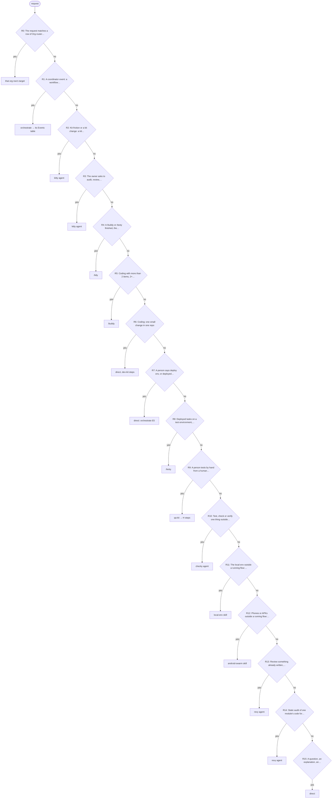
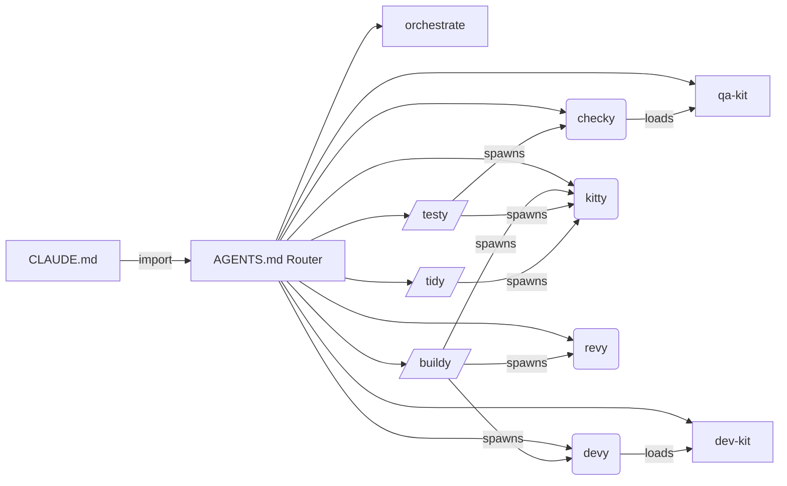
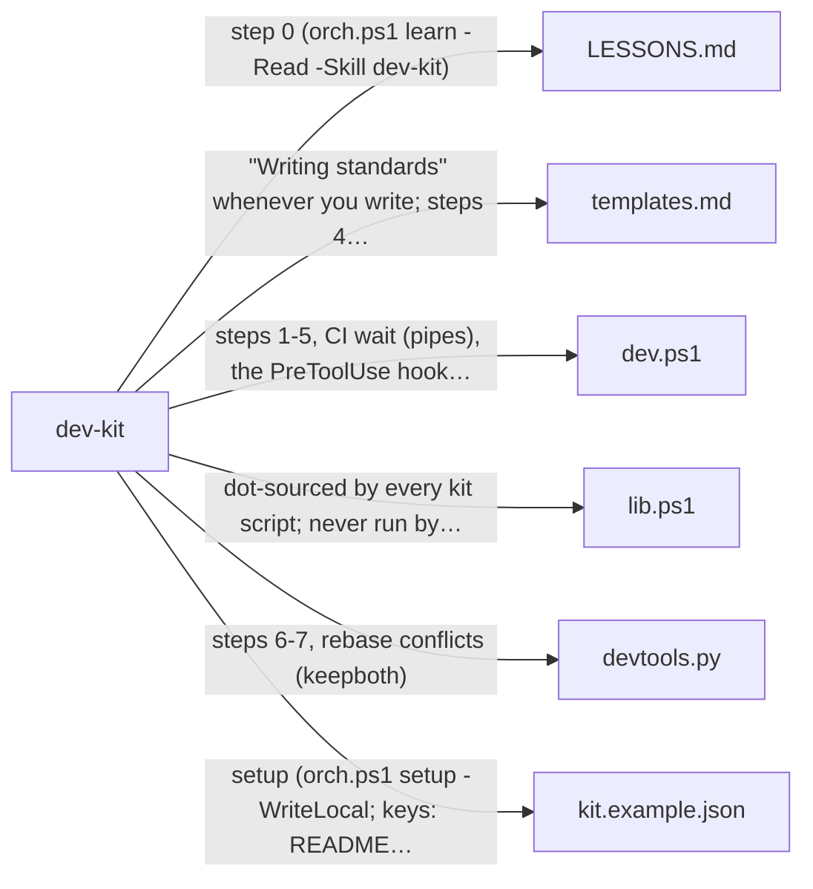
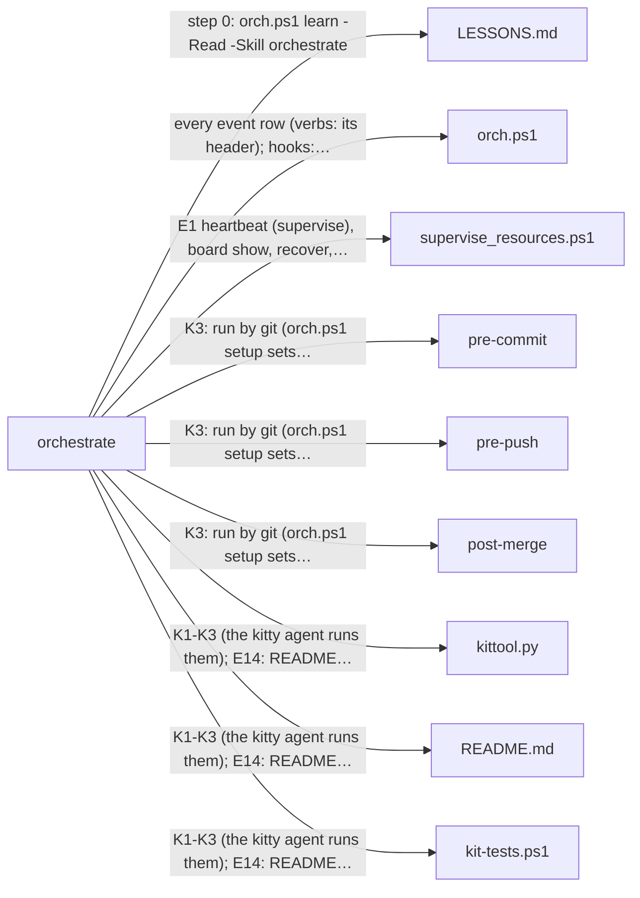
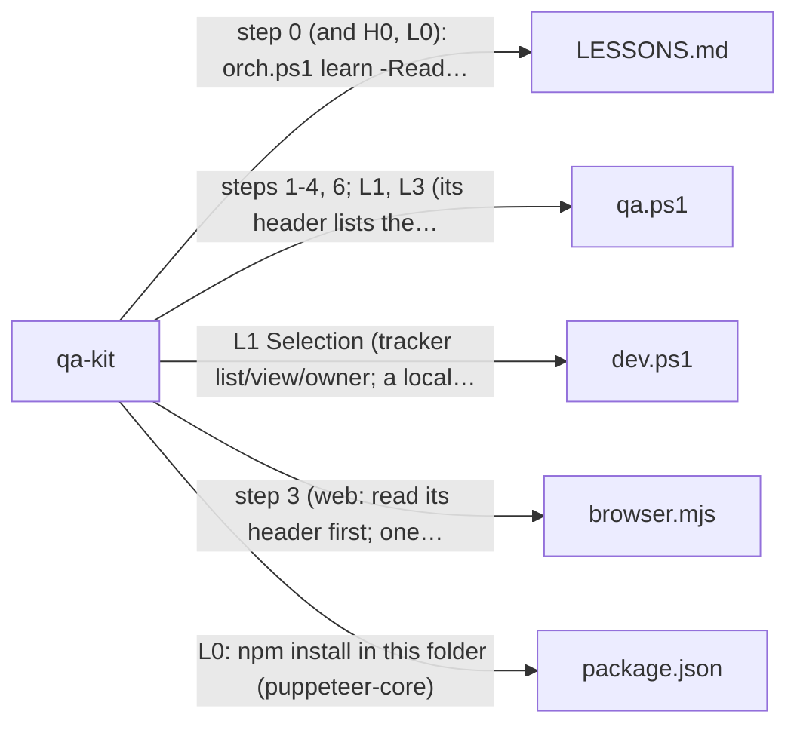

# claude-crew

**[Interactive kit map ->](https://prskid1000.github.io/claude-crew/)** (every command, step, decision and loop; built on each push with the `flow-map` extra)

A multi-agent dev + QA kit for Claude Code (ports for Codex and Antigravity) for **any project type**: any stack, migration tool,
local env shape, test env, deploy mechanism and tracker. Org specifics live only in git-ignored config
(`skills/dev-kit/kit.local.json`, `rules/*.local.md`); the kit assumes no tenants, no web + API + app trio, no database.
Every diagram is generated at pre-commit (`kittool.py flow --readme`) from the manifest, the Router and the flow model.

## The crew
The owner talks to the coordinator; it routes each request to a workflow or one crew member (`kit.example.json` `_manifest`).
<!-- kit-graph:start crew -->

```mermaid
flowchart LR
  OW(["owner"]) -->|"asks, says deploy env"| CO["coordinator: Router + Events"]
  CO -->|"R5"| W_buildy[/"buildy"/]
  W_buildy -->|"spawns"| A_devy("devy")
  W_buildy -->|"spawns"| A_revy("revy")
  W_buildy -->|"spawns"| A_kitty("kitty")
  CO -->|"R8"| W_testy[/"testy"/]
  W_testy -->|"spawns"| A_checky("checky")
  W_testy -->|"spawns"| A_kitty("kitty")
  CO -->|"R4"| W_tidy[/"tidy"/]
  W_tidy -->|"spawns"| A_kitty("kitty")
  CO -->|"R5, R6"| A_devy("devy")
  CO -->|"R13, R14"| A_revy("revy")
  CO -->|"R10"| A_checky("checky")
  CO -->|"R2, R3"| A_kitty("kitty")
```
<!-- kit-graph:end -->
<!-- kit-graph:start table-crew -->
| Agent | Job | Kinds / roles | Used in | Can't | Character |
|---|---|---|---|---|---|
| `devy` | builder: makes or changes anything in product repos through the dev flow | feature · fix · refactor · migration · config · doc · tests · spike · repro | /buildy, R5, R6 | deploy, merge into deploy branches, edit the kit | pragmatic builder: "Small, tested, shipped." |
| `revy` | reviewer: reviews anything and suggests concrete changes | mr · kit · doc · qa · plan · module · config | /buildy, R13, R14 | edit anything (suggests only) | sceptical, blunt: "Show me the test." |
| `checky` | tester: tests or verifies anything, always with evidence | task · smoke · regression · repro · data · perf · claim (roles: lead / test / verify) | /testy, R10 | edit code, leave its target, load shared envs | paranoid, evidence-obsessed: "Screenshot or it didn't happen." |
| `kitty` | kit caretaker: the kit and the machine setup | build · fix · audit · retro · setup · env · recover · docs | /tidy, R2, R3 | touch product repos | tidy and frugal: "Measure before and after." |
<!-- kit-graph:end -->
Board and disagreements: AGENTS.md "Crew".

## Router
First matching row wins (from the `AGENTS.md` Router table).
<!-- kit-graph:start router -->

```mermaid
flowchart TD
  Q(["request"]) --> R0
  R0{"R0: The request matches a row of Org router…"} -->|"yes"| T0["that org row's target"]
  R0 -->|"no"| R1
  R1{"R1: A coordinator event: a workflow…"} -->|"yes"| T1["orchestrate → its Events table"]
  R1 -->|"no"| R2
  R2{"R2: Kit friction or a kit change: a kit…"} -->|"yes"| T2["kitty agent"]
  R2 -->|"no"| R3
  R3{"R3: The owner asks to audit, review,…"} -->|"yes"| T3["kitty agent"]
  R3 -->|"no"| R4
  R4{"R4: A /buildy or /testy finished, the…"} -->|"yes"| T4["/tidy"]
  R4 -->|"no"| R5
  R5{"R5: Coding with more than 2 items, 2+…"} -->|"yes"| T5["/buildy"]
  R5 -->|"no"| R6
  R6{"R6: Coding: one small change in one repo"} -->|"yes"| T6["direct, dev-kit steps"]
  R6 -->|"no"| R7
  R7{"R7: A person says deploy env, or deployed…"} -->|"yes"| T7["direct: orchestrate E5"]
  R7 -->|"no"| R8
  R8{"R8: Deployed tasks on a test environment,…"} -->|"yes"| T8["/testy"]
  R8 -->|"no"| R9
  R9{"R9: A person tests by hand from a human…"} -->|"yes"| T9["qa-kit → H steps"]
  R9 -->|"no"| R10
  R10{"R10: Test, check or verify one thing outside…"} -->|"yes"| T10["checky agent"]
  R10 -->|"no"| R11
  R11{"R11: The local env outside a running flow:…"} -->|"yes"| T11["local-env skill"]
  R11 -->|"no"| R12
  R12{"R12: Phones or APKs outside a running flow:…"} -->|"yes"| T12["android-swarm skill"]
  R12 -->|"no"| R13
  R13{"R13: Review something already written,…"} -->|"yes"| T13["revy agent"]
  R13 -->|"no"| R14
  R14{"R14: Static audit of one module's code for…"} -->|"yes"| T14["revy agent"]
  R14 -->|"no"| R15
  R15{"R15: A question, an explanation, an…"} -->|"yes"| T15["direct"]
```
<!-- kit-graph:end -->

## Flows
- `/buildy`: devy codes and tests on the local env in a loop, revy reviews, the workflow merges; only a person's `deploy <env>`
  ships it (`deploy.trigger`).
- `/testy`: checky lead / test / verify per testing doc; the result rule closes the task, fails it back to dev or files one [Bug].
- Tasks move through logical tracker statuses (`tracker.statuses` maps them to your board's names). The local env: one shared
  instance per env, branches as layers. WIP commits after every dev-flow step: a fresh agent loses nothing after a crash. The kit
  learns from every run (`/tidy`) and fixes itself in a kit worktree.
<!-- kit-graph:start table-workflows -->
| Workflow | Covers | Crew | Router row |
|---|---|---|---|
| `/buildy` | any multi-item build: features, fixes, refactors, migrations, bug waves, resume, duels | `devy`, `revy`, `kitty` | R5 |
| `/testy` | any test run: tracker selection, smoke after a deploy, regression sweep, retest, on local or a test env | `checky`, `kitty` | R8 |
| `/tidy` | kit upkeep: learning signals -> lessons + rule updates, cleanup, the weekly audit kick-off | `kitty` | R4 |
<!-- kit-graph:end -->

## Budget and handoff
The rule: "Configuration" `budget`; per-tool defaults in the table. Models (`MODELS` in each workflow; `agents[].model` / `items[].model`
win): devy, revy, checky test / verify / prepare = sonnet; close, ci, ship, learn = haiku; one stronger retry = opus; `complex` (buildy,
`bugbrief -Complex`) = the session model. Agents spawned by hand: their agent file's `model`.
<!-- kit-graph:start table-budget -->
| Tool / window | Budget | Source |
|---|---|---|
| claude-1m | 967000 | Claude Code docs: 1M models compact at ~967k |
| claude-200k | 167000 | conservative 83.5% of 200k (docs: at the limit) |
| codex | 0.9 x window | 0.9 x the models_cache.json window; auto_compact_token_limit wins |
| antigravity | 0.8 x window | unverified: 0.8 x the model window |
| unknown | 160000 | 0.8 x 200k |
<!-- kit-graph:end -->

## Leases
One rule (lib.ps1 `Update-KitLease`, lint LEASE-HOLDER) for env services, browser tabs, phones, builds, runtimes (extra `runtimes`);
only owner holds (`localenv.ps1 up -Owner`, phone `manual`; extra `local-env`, extra `android-swarm`) keep minutes, with a reminder.

## Pause and resume
- **Checkpoints** (both paths): each agent runs `dev.ps1 checkpoint` at every step boundary (worktree, commit, testing goals,
  loop round, MR, review, CI, testing doc, tracker, merge; QA: each check): `work/agents/<id>/resume.json` + `resume.md`. Kit
  state is written atomically (temp + rename) or appended; leases, gate slots and board entries keep their process id with its
  start time (a pid reused after a cold boot holds nothing); a lock whose holder died is taken at once (Windows).
- **Pause** (power off, a day offline): `orch.ps1 pause -All | -Run <run> [-Reason] [-Wait 10]`. Agents read PAUSE on their
  next `board beat` (and inbox), checkpoint, commit WIP locally, release leases and leave the board `paused`; env services no
  live holder needs stop (extra `local-env`); `.state/pauses/` records runs, launch records, agents, checkpoints and worktree
  heads; it prints "safe to power off". Nothing after it needs the network.
- **Crash** (power loss, kill): SessionStart `health` marks dead board entries and launch records crashed and prints
  `paused/crashed runs: N -> orch.ps1 resume`.
- **Resume**: `orch.ps1 resume -All | -Run <run> [-Wait <min>]`. Offline -> says so, stops. Per agent a brief
  (`work/agents/<id>/resume-brief.md`) starting AT its next step: done steps verified (commit present, MR state), never
  redone; the uncommitted diff kept for the interrupted step; journal results kept (`resumeFromRunId`); a run whose MRs all
  merged skipped; then the exact Workflow call. `board join` shows each relaunched agent its CHECKPOINT.
- Kept: commits, diffs, MRs, tracker state, decisions, checkpoints, launch records, coordinator program state (`orch.ps1
  program set|get`). Lost: agent conversations (a fresh agent from its brief), running builds and tests (rerun), env service
  processes (started on the next lease), browser logins.

## Install
```powershell
git clone https://github.com/prskid1000/claude-crew <workspace>/.claude
pwsh -File <workspace>/.claude/skills/orchestrate/orch.ps1 setup -WriteLocal   # git hooks, excludes, .runtime/.state, local config stubs
```
Needs pwsh 7, Python 3.8+, git, Node 18+, `glab` or `gh`; optional: the tracker CLI, `gws`, the Android SDK. Fill
`skills/dev-kit/kit.local.json`, `skills/qa-kit/targets.local.json` (the only place for passwords), phones: `swarm.config.json` (extra android-swarm);
`npm install` in `skills/qa-kit`. Update: `git pull` once nothing runs.
Org specifics: settings in `kit.local.json` (keys: "Configuration"); org rules, house style, extra CLIs and **Org router rows** (the
Router's columns) in `rules/*.local.md`; products, repos, test envs (names only), deploy rules and tracker statuses there too; org-only
skills listed in `localOnly`.
Not ported to Codex / Antigravity: the SendMessage guard hook, the live-kit edit guard on Antigravity file edits, the Workflow
and Skill tools, the Antigravity tools allow-list; the board, learn signals and decision pauses run by hand from the ported
procedures.

## Using it
- Ask the main session; the Router launches the rest. The heartbeat (`orch.ps1 supervise -AutoFix -Brief`; its last line `NEXT <n> min`
  sets the next one, 5-30 min by state) prints the owner's report: resources and their holders, flags (ACT, WATCH, ❓ ASK). After a restart: `orch.ps1 resume -All`.
  Every script prints its usage without arguments.

## Extras
Optional parts (more trackers, git hosts, CI and report types, stack presets, the local env, phone lanes, deploys, kit admin and
scaffolding, the duel mode) live on the origin's `extras` branch, one folder each; the core stays small.

**Use** (`python -X utf8 skills/orchestrate/kittool.py extra <verb>`):
- `list`: the extras on `origin/extras` (`*` = installed) · `check`: config that needs a missing extra · `add <name>` /
  `remove <name>`: install / delete its files and list / unlist it in kit.local.json `extras` (always installed) · `sync`:
  installs every extra whose "Needed when" matches, updates changed ones only while the kit is not behind origin/main (then an
  extra merged into another or into the core, kittool `MERGED_EXTRAS`, is swapped: old files out, a listed old name relisted) ·
  `test [<name>]`: installed extras' tests · `prune [--days N] [--dry-run]`: drops extras unused > N days (default 30;
  /tidy prep passes the learned value) that no "Needed when" asks for and `extras` does not list.
- Files install at their kit path, local-only (`.git/info/exclude`: never pushed, outside the budget). `sync` runs in
  SessionStart `health`, `setup` and the post-merge hook (a pull is followed by a sync: an old extra may need the new core).
- On demand: a config-named adapter (tracker, git host, ci) missing at lib.ps1 load, or a verb that needs a missing extra, runs
  `extra add <name> --auto` (unlisted) and runs the verb again once; a failed try waits 1 h; `KIT_EXTRA_AUTO=0` turns it off
  (tests). Offline or refused: the stop line `<feature> is an extra: run kittool.py extra add <name>`.
- Use: the code that runs an extra's adapter, verb, hook or command touches `<state>/extras-used/<file>` once a day.

**Write one** (`kitty`):
- Shape: `extras/<name>/files/<kit path>` (each file where it installs), `extras/<name>/EXTRA.md` (What; `Needed when:`;
  Wiring), `extras/<name>/tests.ps1` (`tests/harness.ps1` helpers; runs the `tests-*.ps1` of extras merged into it).
- `Needed when:` forms, `,` = any: `` `key` = `v` | `w` `` (`` = `*` ``: set; `*` in a key walks keys and list items:
  `repos.*.ci`), `` `key` ~ `v` `` (contains), `` `<path>` exists ``, `` `<glob>` in a repo `` (a `repos[].checkout` tracks one),
  `` `<os>` OS `` (windows, linux, macos), `` origin ~ `v` `` (the kit's or a repo's origin URL); `Needed when (<file>.json):` reads that
  file. Listed in `extras`: always installed.
- Seam: core calls the extra when it is loaded, else prints the stop line; never a broken reference (lint and tests pass without
  it).
- Move a core part out: `git grep` its callers, a seam at each, its files + tests to `extras/<name>/`, README / Files rows /
  manifest updated; lint + tests on main, `extra test <name>` with it.
- Publish: `git -C <kit> worktree add -b kit/extras-<date> <dir> origin/extras`, commit, `git push origin HEAD:extras`.
- `main` and `extras` are protected: fast-forward pushes only (on a reject: fetch, rebase), never force or delete. The guard
  denies force, delete and move from the kit clone and its worktrees; `orch.ps1 setup` sets it on the kit origin (host verb `branch.protect`;
  hosts without it: the by-hand line), `health` reports it missing.

## Configuration
`skills/dev-kit/kit.local.json`, every key optional; the table is generated from `kit.example.json` (`_readme` / `_doc`).
<!-- kit-graph:start table-config -->
| Key | Example / default | Meaning |
|---|---|---|
| `gitHost`, `gitHostType`, `githubHost`, `gitlabGroup` | gitlab.com | the git host (type from the host) and the group / owner for short refs &lt;repo&gt;!&lt;iid&gt; |
| `reposRoot`, `worktreeRoots`, `repoAliases`, `protectedBranches` | /path/to/src | checkouts (default the workspace), worktrees (&lt;repos&gt;-wt); short repo names; branches never force-pushed; protectedBranchesMode extend (replace: without main/master/develop) |
| `commitStyle`, `locale.testCommentPattern`, `locale.proseTerms` |  | subject rule conventional (free / a regex); English defaults: testing comment, prose required words ({expected: regex, ...}) |
| `devices` | {"type": "android"} | type: android (default) / none (verbs refuse, app checks NOT_TESTED); ios: extra ios-simulator |
| `trackerRepos`, `trackerLists`, `productTargets` | ["backend", "frontend", "mobile-app"] | repos searched for a task's MRs; tracker containers for deploy intest; which env a path needs |
| `holdMerge` | [] | repos (or true = all) whose MRs a person merges (their target deploys): devtools.py merge says NOT_MERGED held for approval |
| `repos` | [{"name": "backend", "aliases": ["api"], "checkout":… | role producer / consumer; migrations.check = the repo's own migration check (else Liquibase: extra liquibase; another tool: UNRUN); deploys[] per env (production: true = never tested): CI branch + job (= target: trunk), laneApk; ssh, awsStack, probe, tag, manual: extra deploys |
| `driveParent` | &lt;Drive folder or shared-drive id (gdocs)&gt; | Drive folder or shared drive for testing docs and reports (reports.type gdocs) |
| `supervise` | {"ramActPct": 90, "minDiskFreeGB": 30, "askOwnerGB": 2,… | heartbeat: ramActPct, minDiskFreeGB, askOwnerGB (a bigger, idle or growing app: one ASK), ramNames (default _manifest.ram), briefSeconds (one -Brief round); heartbeatMinutes (15) = the base of the NEXT &lt;n&gt; min each round prints (5 to 30 by state; manyAgents 8) |
| `idle` | {"graceMinutes": 10, "beatMinutes": 20} | README Leases: no live holder for graceMinutes -&gt; released; a board beat counts for beatMinutes |
| `cleanup` | {"maxBrowserProfiles": 4, "worktreeDays": 7} | maxBrowserProfiles: browser profiles kept; worktreeDays (7): a clean worktree whose remote branch is gone goes after that idle time (local branch kept), one with uncommitted files is only reported |
| `localOnly`, `orgTerms`, `extras` | ["skills/&lt;org-only-skill&gt;", "&lt;another org-only path&gt;"] | org-only kit paths kept out of git; words the pre-push gate blocks; extras kittool.py extra sync always installs (extra add lists one, remove unlists it) |
| `localFiles` | {"skills/qa-kit/targets.local.json": {"_readme": "One entry per TEST… | example only: orch.ps1 setup -WriteLocal writes targets.local.json from it |
| `localEnv` |  | local envs the dev flow tests on before merge; `defaults` / `envs.&lt;env&gt;.extends` share one shape (extra local-env: its SKILL.md has the shape and an example) |
| `runtimes` |  | machine runtimes agents lease (container engine, WSL distro, VM): &lt;name&gt;: isUp, up, down, match (extra runtimes: its EXTRA.md has the shape) |
| `gitHostApi` | {"commands": {}} |  |
| `ci` | {"type": "host"} |  |
| `tracker` | {"type": "none", "repo": "&lt;owner/name, for github issues&gt;", "list":… | type: none (default) / command; github, clickup, gitlab, jira, jira-server, linear, azure, youtrack: extras (kittool.py extra list). statuses maps the logical statuses to your board's names (a list = the first is set, all match); statusLabelPrefix: github status labels (status:); priorities: names of 1-4, space separated. Examples: _examples. |
| `reports` | {"type": "markdown"} | type: markdown, html (a kept file) / command (command '&lt;cli&gt; {title} {path} {parent}' printing the URL); gdocs (Google Doc + Drive evidence via gws; default with gws), pdf, confluence, notion: extras. share (gdocs): anyone (default) / domain:&lt;domain&gt; / none |
| `qa` | {"seatGB": {"web": 1.5, "api": 0.4, "app": 0.4}, "outOfScope": ["&lt;a… | shutterText / confirmText: camera label regexes. outOfScope: channels agent QA never tests (their steps are OUT_OF_SCOPE: reported, never counted). targets: target groups for /testy select runs (target: '&lt;group&gt;'): per task the first rule whose lists / repos / nameRegex / pathRegex match gives its env (localEnv: a local env, live = in its running release). seatGB: RAM one QA seat promises per kind. |
| `deploy` | {"trigger": "owner", "minIntervalHours": {"default": 4, "&lt;target&gt;":… | trigger: owner (default: nobody asks or proposes a deploy; a person says deploy &lt;env&gt; and the coordinator deploys at once) or ask (one batched ask per env, at most one per minIntervalHours: a number, or per target with a default). planTimeoutSec bounds orch.ps1 deploy plan; productionPattern ((?i)prod/critical): production by name when production is unset. |
| `net` | {"timeoutSec": 60} | timeoutSec per git-host / tracker CLI call; transient errors retry, lost tracker writes wait in .state/outbox.jsonl (supervise replays them) |
| `tests` | {"maven": {"testFor": ["{name}Test", "{name}IT"]}} | Per stack (dev.ps1 stack names): the test names -Touched looks for, from a changed source file's base name ({name}). Defaults: maven/gradle {name}Test, {name}Tests, {name}IT; dotnet {name}Tests, {name}Test; python test_{name}, {name}_test; go {name}_test; web {name}.spec, {name}.test. |
| `guard` | {"layout": "warn"} | layout: warn (default) / block: an agent's own write into .runtime / .state outside the _paths names (dev.ps1 dir gives its place; kit scripts are exempt). |
| `memory` | {"keepDefault": false} | keepDefault: false = Claude Code auto memory lives in &lt;kit&gt;/memory/ (git-ignored); true = keep the user's own setting. |
| `kitAudit` | {"everyDays": 7} | everyDays: the SessionStart nudge asks for a kitty audit when the last audit is older (default 7; 0 = off). |
| `build` | {"mavenOffline": true} | mavenOffline: Maven runs with -o when ~/.m2/repository exists (default true). |
| `gate` | {} | Memory gate. keepFreeGB (default 15% of RAM, min 6) = RAM every build leaves free; startHeapGB, heapMinGB: extra build-heap; cacheFlush (unset) = a command line supervise -AutoFix runs when a gate head waited 10+ min and the file cache holds 25%+ of RAM (at most every 30 min). |
| `storage` | {"watch": [], "sampleSeconds": 60, "keepDays": 30, "watchFreeGB": 50,… | orch.ps1 storage: free space per fixed drive each sampleSeconds in .state/storage (keepDays). ACT + rescue: a fill sustained 10 min, full within actHours or factor x the learned normal (&gt;= minRateGBh) below watchFreeGB; floors (watchFreeGB, supervise.minDiskFreeGB) on drives with kit paths only. Rescue: the db query holding temp killed, builds held holdMinutes. Folder scans (background): a drop &gt;= scanDropGB (scanCooldownMin), scanHours, ACT; defaults + watch[] (org paths) + learned children (drillGB, flatDays). db.use prints &lt;id&gt; &lt;temp GB&gt; &lt;seconds&gt; &lt;query&gt; per query; db.kill uses {id}; a query above db.maxGB (5) is killed. TODO-PARAM. |
| `budget` | {"handoffAt": 0.8, "runStopAt": 0.8, "estimate": {"devy": 70000,… | An agent's budget = its tool's default compaction point (orch.ps1 budget; defaults below); handoff at handoffAt x budget; a run's cap = its planned agents' budgets (launch -Self -Plan): an estimate over runStopAt x cap is refused with the split, at runStopAt x cap no new item starts (the rest = next). estimate: per agent / item |
<!-- kit-graph:end -->
Env vars: `CLAUDE_RUNTIME`, `CLAUDE_WT_ROOT`, `CLAUDE_AGENT`, `CLAUDE_GATE_KEEP_FREE_GB`, `KIT_TRACKER_TYPE`, `KIT_TRACKER_DRYRUN`,
`KIT_REPORT_TYPE`, `KIT_NET_TIMEOUT_SEC` / `KIT_NET_TRIES` / `KIT_NO_OUTBOX`, `CHROME_PATH`; extras name their own (EXTRA.md).
A repo whose stack is detected wrongly: `.claude-stack.json` next to its build file (`{ "commands": { "test": "make test T={tests}" } }`).

## Adapters
One interface per kind, chosen by config; `command` = your CLI per verb (`{placeholders}` in, JSON out); `kittool.py new adapter <kind> <name>` scaffolds one.
<!-- kit-graph:start table-adapters -->
| Kind | Selected by | Interface (verbs) | Built in | Code |
|---|---|---|---|---|
| tracker | `tracker.type` | view url status comment comments create describe rename attach list owner | command, none | `skills/dev-kit/lib.ps1` |
| git-host | `gitHostType` | mr.get mr.list mr.changes mr.create mr.merge mr.unauto mr.url repo.base repo.commit repo.compare branch.protect | command | `skills/dev-kit/lib.ps1` |
| report | `reports.type` | publish | markdown, html, command | `skills/dev-kit/devtools.py` |
| ci | `ci.type` | runs jobs log status config | command, none | `skills/dev-kit/lib.ps1` |
<!-- kit-graph:end -->

## Layout, state and safety
- `<kit>/.runtime/` disposable (`work/` runs, `cache/` rebuildable, `logs/` service logs), `<kit>/.state/` durable; both
  git-ignored. `kit.example.json` `_paths` is the one map: scripts resolve names (`Get-KitPath`, `kit_path`, `kitPath`, `rp()`;
  lint RUNTIME-RAW), `_paths.keep` the retention per name. Agents write only under `dev.ps1 dir`: `work/agents/<agent>/[<item>/]`
  (scratch) and `work/evidence/<item>/` (`<agent>-<what>.<ext>`); names lowercase-kebab, dates ISO. The guard notes any other
  write into either root (`guard.layout: block` denies it).
- Logs: every line through kitlog (`Write-KitLog`, `kitlog()`; lint LOG-DIRECT), masked, with time, run, agent, task, script,
  verb: streams `calls` (each verb's start / end, rc, ms), `builds` (gate wait, peak, code), `env`, `guard` in
  `.state/audit/<date>/<stream>.jsonl` (30 d); `signals`, `decisions-log`, `deploy-log` in their `.state` files.
  `orch.ps1 audit -Run | -Agent | -Task [-Since]` merges them with the workflow journal and the board into one timeline.
- `orch.ps1 cleanup [-DryRun]` removes only kit-created leftovers: `_paths.keep` ages, entries off the layout (runtime root
  after 3 d, `work/` 14 d, `cache/`, `logs/` 30 d; durable ones listed only), worktrees + local branches whose MR merged at the
  tip or whose tip is in origin's default branch (clean, unclaimed; `-WorktreesOnly`); Claude session temp: reported only.
- The PreToolUse guard blocks `git stash`, `--no-verify`, force-pushes to shared branches, ungated builds, hand-started dev
  servers, `adb kill-server` and edits to the live kit clone's tracked or new files (edit a kit worktree; a deliberate live
  edit: `KIT_LIVE_EDIT=1` in the session env or the command). Deploys start only from a person's word. Never production. One
  machine (the memory gate is local); workflows, hooks and skills are Claude Code-only (Codex / Antigravity get ported agents and procedures).
## Extending (change the kit)
The kit is the workspace's `.claude` folder, a git clone of this repo; `kitty` changes it in a kit worktree while runs execute the
live clone, keeps it generic, gets a `revy` review and pushes main; an optional feature goes to the `extras` branch, not the core.
The rules, part shapes, lint codes and pre-push checks: `skills/orchestrate/kit-admin.md` (extra `kit-admin`). A script over
~2,000 tokens opens each part with a `# ---- <name>: <what>` line (`// ----` in JS) and maps them in a `Sections:` header line
(`kittool.py sections --fix`; lint SECTION-MAP, SECTION-UNMAPPED; a section over 600 lines: audit WARN SECTION-BIG). Token budgets
(lint BUDGET; UTF-8 bytes / 4, README graph sections excluded; `kittool.py budget` prints both totals). The kit total measures
what agents load; `tests/` has its own cap (all tests, lint BUDGET-TESTS) because agents never load it:
<!-- kit-graph:start table-caps -->
always 3500 · skill 3200 · agent 2400 · rule 900 · template 2600 · templates 4000 · doc 7000 · lessons 30000 · workflow 15000 · ps1 58000 · py 77000 · mjs 8000 · json 6600 · tests 8000 · total 242000 · all tests 44000 · files: 30 content + 8 plumbing
<!-- kit-graph:end -->

One behaviour, one test case: core in `tests/`, an extra's in `extras/<name>/tests.ps1`, shared setup in `tests/harness.ps1`; a case name
(its PASS / FAIL line) seen twice fails `tests/kit-tests.ps1` (TEST-DUP).

## Rule examples
Path-scoped rule templates to copy into `rules/` (database migrations, any tool):
`skills/orchestrate/kit-admin.md` "Rule examples" (extra `kit-admin`).

## How the kit fits together
Generated by `kittool.py flow --readme` (pre-commit); interactive: the `flow-map` extra (public: the kit map above).
<!-- kit-graph:start map -->

```mermaid
flowchart LR
  CLAUDE_md["CLAUDE.md"] -->|"import"| AGENTS_md["AGENTS.md Router"]
  agents_checky_md("checky")
  agents_devy_md("devy")
  agents_kitty_md("kitty")
  agents_revy_md("revy")
  skills_dev_kit_SKILL_md["dev-kit"]
  skills_orchestrate_SKILL_md["orchestrate"]
  skills_qa_kit_SKILL_md["qa-kit"]
  workflows_buildy_js[/"buildy"/]
  workflows_testy_js[/"testy"/]
  workflows_tidy_js[/"tidy"/]
  AGENTS_md --> agents_checky_md
  AGENTS_md --> agents_devy_md
  AGENTS_md --> agents_kitty_md
  AGENTS_md --> agents_revy_md
  AGENTS_md --> skills_dev_kit_SKILL_md
  AGENTS_md --> skills_orchestrate_SKILL_md
  AGENTS_md --> skills_qa_kit_SKILL_md
  AGENTS_md --> workflows_buildy_js
  AGENTS_md --> workflows_testy_js
  AGENTS_md --> workflows_tidy_js
  workflows_buildy_js -->|"spawns"| agents_devy_md
  workflows_buildy_js -->|"spawns"| agents_kitty_md
  workflows_buildy_js -->|"spawns"| agents_revy_md
  workflows_testy_js -->|"spawns"| agents_checky_md
  workflows_testy_js -->|"spawns"| agents_kitty_md
  workflows_tidy_js -->|"spawns"| agents_kitty_md
  agents_checky_md -->|"loads"| skills_qa_kit_SKILL_md
  agents_devy_md -->|"loads"| skills_dev_kit_SKILL_md
```
<!-- kit-graph:end -->

<!-- kit-graph:start skill-dev-kit -->

```mermaid
flowchart LR
  skills_dev_kit_SKILL_md["dev-kit"]
  skills_dev_kit_SKILL_md -->|"step 0 (orch.ps1 learn -Read -Skill dev-kit)"| LESSONS_md["LESSONS.md"]
  skills_dev_kit_SKILL_md -->|"#quot;Writing standards#quot; whenever you write; steps 4…"| skills_dev_kit_templates_md["templates.md"]
  skills_dev_kit_SKILL_md -->|"steps 1-5, CI wait (pipes), the PreToolUse hook…"| skills_dev_kit_dev_ps1["dev.ps1"]
  skills_dev_kit_SKILL_md -->|"dot-sourced by every kit script; never run by…"| skills_dev_kit_lib_ps1["lib.ps1"]
  skills_dev_kit_SKILL_md -->|"steps 6-7, rebase conflicts (keepboth)"| skills_dev_kit_devtools_py["devtools.py"]
  skills_dev_kit_SKILL_md -->|"setup (orch.ps1 setup -WriteLocal; keys: README…"| skills_dev_kit_kit_example_json["kit.example.json"]
```
<!-- kit-graph:end -->

<!-- kit-graph:start skill-orchestrate -->

```mermaid
flowchart LR
  skills_orchestrate_SKILL_md["orchestrate"]
  skills_orchestrate_SKILL_md -->|"step 0: orch.ps1 learn -Read -Skill orchestrate"| LESSONS_md["LESSONS.md"]
  skills_orchestrate_SKILL_md -->|"every event row (verbs: its header); hooks:…"| skills_orchestrate_orch_ps1["orch.ps1"]
  skills_orchestrate_SKILL_md -->|"E1 heartbeat (supervise), board show, recover,…"| skills_orchestrate_adapters_supervise_resources_ps1["supervise_resources.ps1"]
  skills_orchestrate_SKILL_md -->|"K3: run by git (orch.ps1 setup sets…"| _githooks_pre_commit["pre-commit"]
  skills_orchestrate_SKILL_md -->|"K3: run by git (orch.ps1 setup sets…"| _githooks_pre_push["pre-push"]
  skills_orchestrate_SKILL_md -->|"K3: run by git (orch.ps1 setup sets…"| _githooks_post_merge["post-merge"]
  skills_orchestrate_SKILL_md -->|"K1-K3 (the kitty agent runs them); E14: README…"| skills_orchestrate_kittool_py["kittool.py"]
  skills_orchestrate_SKILL_md -->|"K1-K3 (the kitty agent runs them); E14: README…"| README_md["README.md"]
  skills_orchestrate_SKILL_md -->|"K1-K3 (the kitty agent runs them); E14: README…"| tests_kit_tests_ps1["kit-tests.ps1"]
```
<!-- kit-graph:end -->

<!-- kit-graph:start skill-qa-kit -->

```mermaid
flowchart LR
  skills_qa_kit_SKILL_md["qa-kit"]
  skills_qa_kit_SKILL_md -->|"step 0 (and H0, L0): orch.ps1 learn -Read…"| LESSONS_md["LESSONS.md"]
  skills_qa_kit_SKILL_md -->|"steps 1-4, 6; L1, L3 (its header lists the…"| skills_qa_kit_qa_ps1["qa.ps1"]
  skills_qa_kit_SKILL_md -->|"L1 Selection (tracker list/view/owner; a local…"| skills_dev_kit_dev_ps1["dev.ps1"]
  skills_qa_kit_SKILL_md -->|"step 3 (web: read its header first; one…"| skills_qa_kit_browser_mjs["browser.mjs"]
  skills_qa_kit_SKILL_md -->|"L0: npm install in this folder (puppeteer-core)"| skills_qa_kit_package_json["package.json"]
```
<!-- kit-graph:end -->
