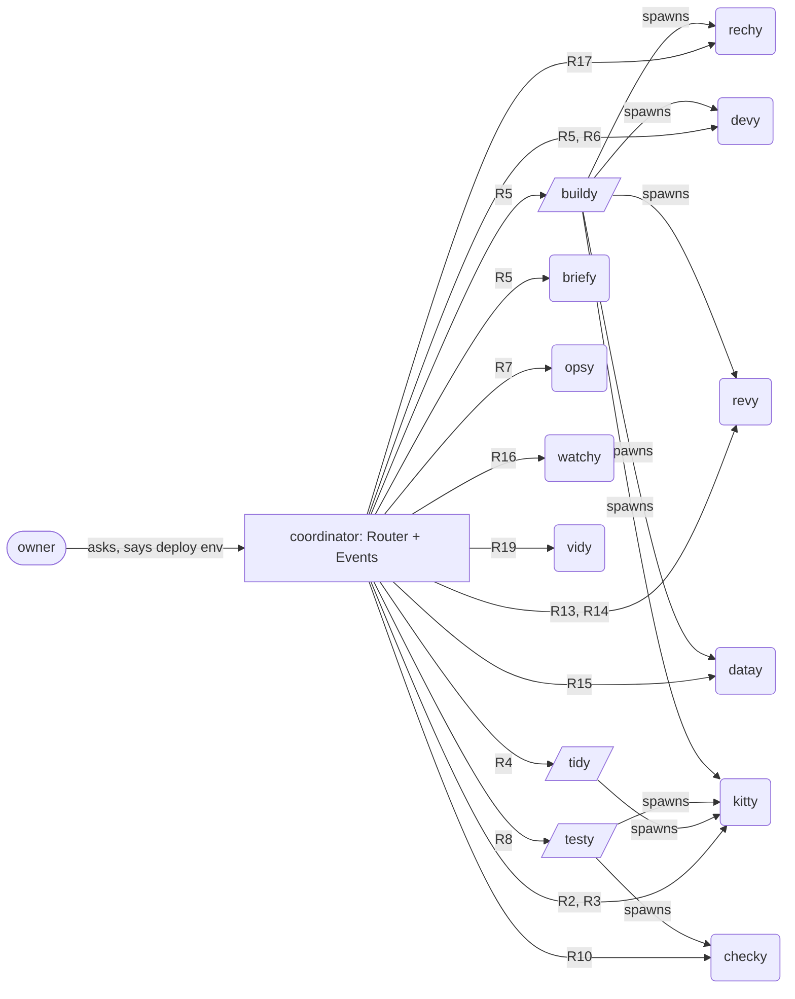
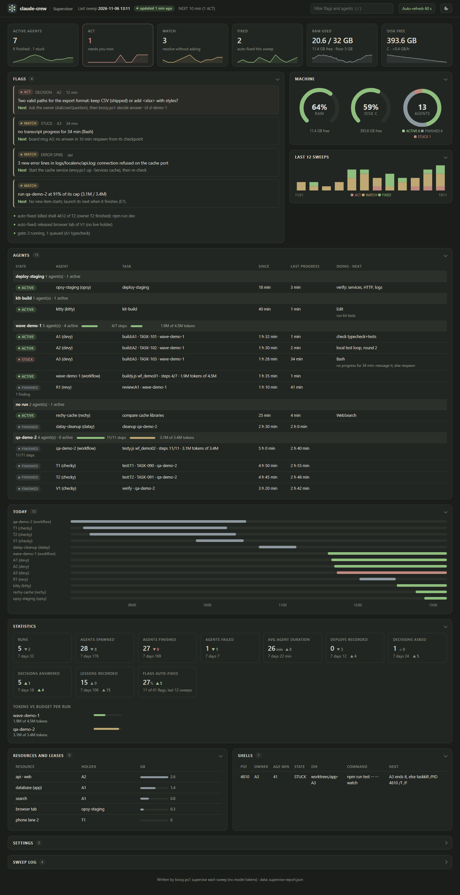
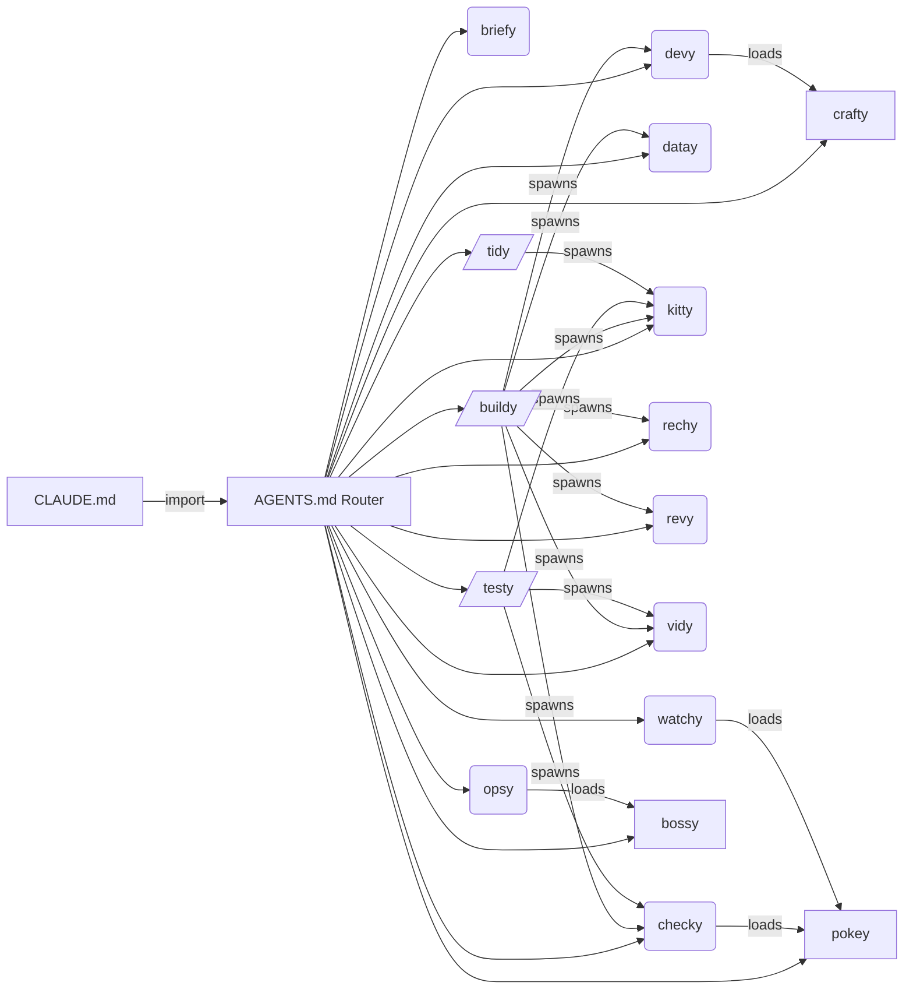
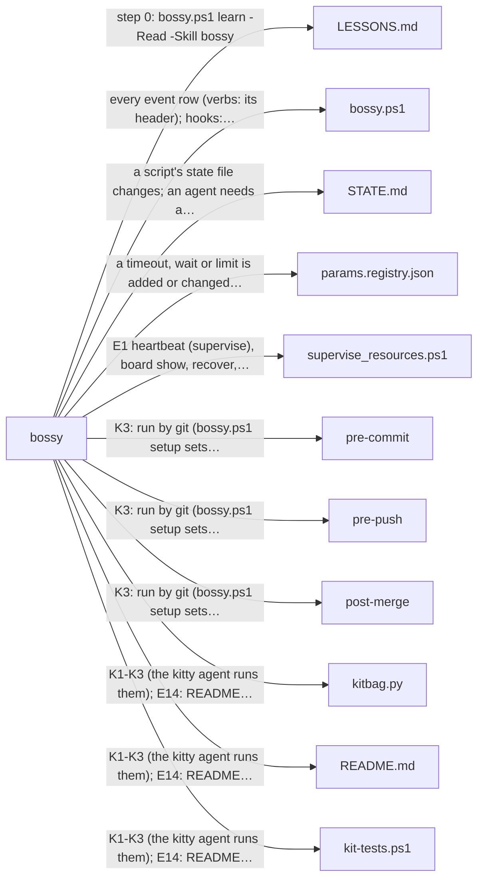
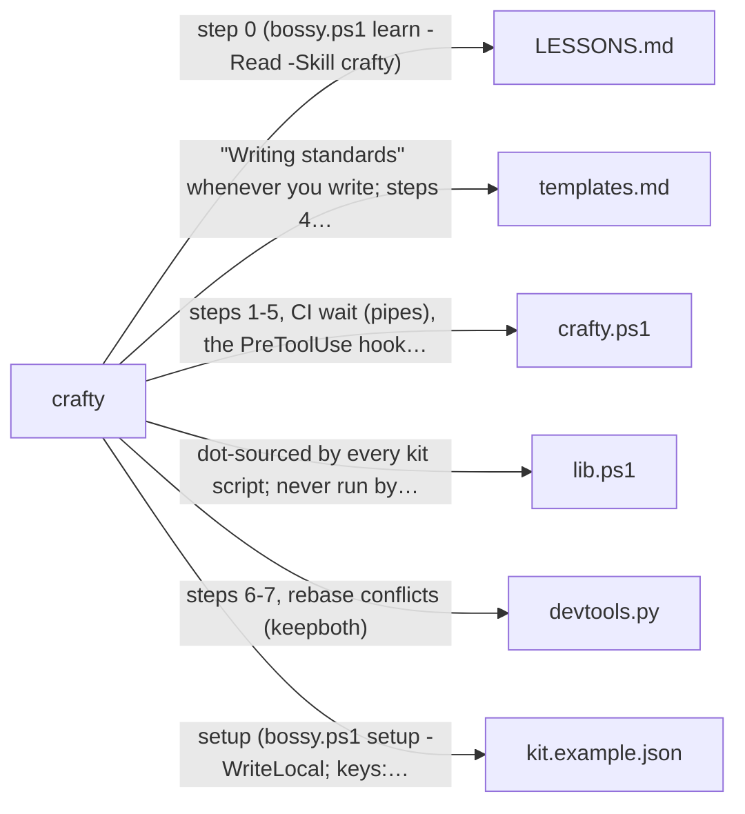
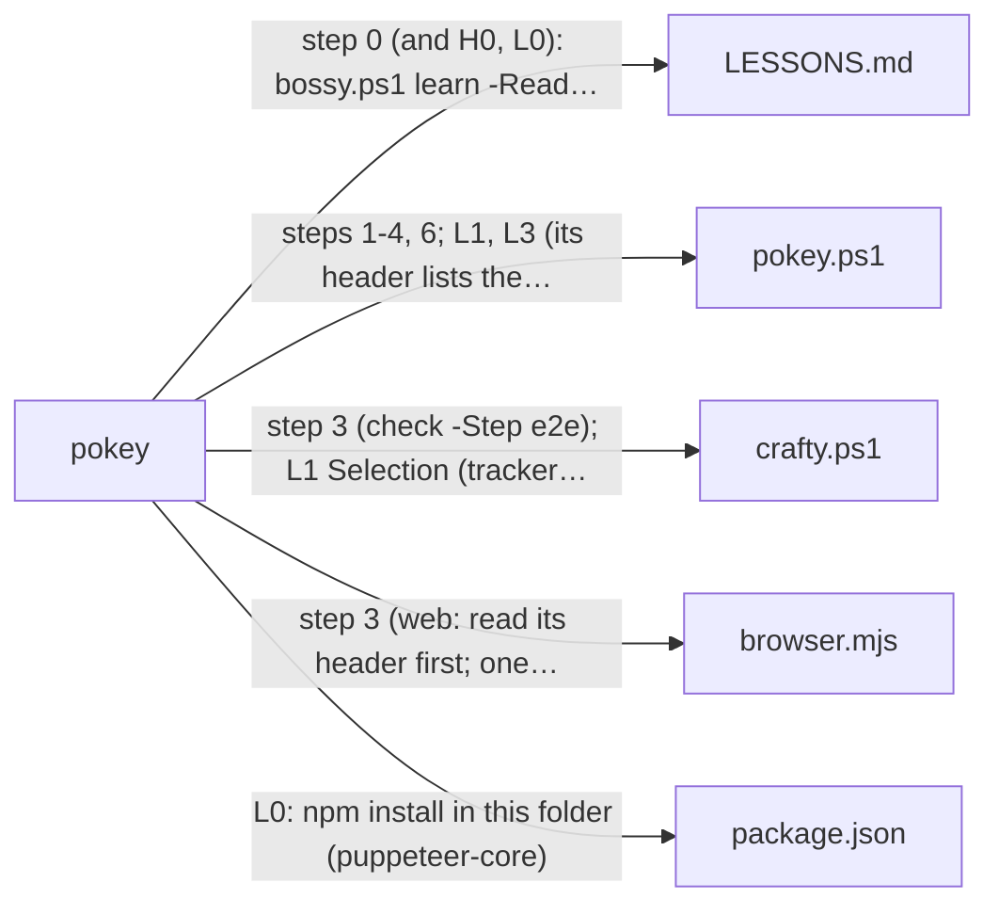

<p align="center"></p>
<p align="center"><b>A crew of AI agents that builds, tests, ships and watches your code, with one coordinator in charge.</b></p>
<p align="center"></p>

# claude-crew

**[Interactive kit map ->](https://prskid1000.github.io/claude-crew/)** (every command, step, decision and loop; built on each push with the `flow-map` goody)

A multi-agent dev + QA kit for Claude Code (ports for Codex and Antigravity) for **any project type**: any stack, migration tool,
local env shape, test env, deploy mechanism and tracker. Org specifics live only in git-ignored config
(`skills/crafty/kit.local.json`, `rules/*.local.md`); the kit assumes no tenants, no web + API + app trio, no database.
Every diagram is generated at pre-commit (`kitbag.py flow --readme`) from the manifest, Router and flow model.

## The crew
The owner talks to the coordinator; it routes each request to a workflow or one crew member (`kit.example.json` `_manifest`).
<!-- kit-graph:start crew -->

```mermaid
flowchart LR
  OW(["owner"]) -->|"asks, says deploy env"| CO["coordinator: Router + Events"]
  CO -->|"R5"| W_buildy[/"buildy"/]
  W_buildy -->|"spawns"| A_rechy("rechy")
  W_buildy -->|"spawns"| A_devy("devy")
  W_buildy -->|"spawns"| A_revy("revy")
  W_buildy -->|"spawns"| A_datay("datay")
  W_buildy -->|"spawns"| A_kitty("kitty")
  CO -->|"R8"| W_testy[/"testy"/]
  W_testy -->|"spawns"| A_checky("checky")
  W_testy -->|"spawns"| A_kitty("kitty")
  CO -->|"R4"| W_tidy[/"tidy"/]
  W_tidy -->|"spawns"| A_kitty("kitty")
  CO -->|"R5, R6"| A_devy("devy")
  CO -->|"R13, R14"| A_revy("revy")
  CO -->|"R10"| A_checky("checky")
  CO -->|"R2, R3"| A_kitty("kitty")
  CO -->|"R5"| A_briefy("briefy")
  CO -->|"R17"| A_rechy("rechy")
  CO -->|"R15"| A_datay("datay")
  CO -->|"R7"| A_opsy("opsy")
  CO -->|"R16"| A_watchy("watchy")
  CO -->|"R19"| A_vidy("vidy")
```
<!-- kit-graph:end -->
<!-- kit-graph:start table-crew -->
| Agent | Job | Kinds / roles | Used in | Can't | Character |
|---|---|---|---|---|---|
| `devy` | builder: makes or changes anything in product repos through the dev flow | feature · fix · refactor · migration · config · doc · tests · spike · repro | /buildy, R5, R6 | deploy, merge into deploy branches, edit the kit | pragmatic builder: "Small, tested, shipped." |
| `revy` | reviewer: reviews anything and suggests concrete changes | mr · kit · doc · qa · plan · module · config | /buildy, R13, R14 | edit anything (suggests only) | sceptical, blunt: "Show me the test." |
| `checky` | tester: tests or verifies anything, always with evidence | task · smoke · regression · repro · data · perf · claim (roles: lead / test / verify) | /testy, R10 | edit code, leave its target, load shared envs | paranoid, evidence-obsessed: "Screenshot or it didn't happen." |
| `kitty` | kit caretaker: the kit and the machine setup | build · fix · audit · retro · setup · env · recover · docs | /tidy, R2, R3 | touch product repos | tidy and frugal: "Measure before and after." |
| `briefy` | brief writer: /buildy brief, contracts, impact check, rule changes | brief · bugfix · rule-change | R5, E8 | write code, launch runs | exacting planner: "Who owns this field?" |
| `rechy` | researcher: cited answers before building or deciding | question · compare · library · licence · spike | /buildy, R17 | edit anything but its findings | skeptical librarian: "Cite it or drop it." |
| `datay` | data guardian: test data, local DB, migration data, backfills | cleanup · fixture · migration · localdb · backfill · check | /buildy, R15, E2, E7 | write production, edit code or the kit | meticulous archivist: "Mark it, count it, then touch it." |
| `opsy` | deploy pilot: deploys on a person's word, verifies, rolls back | deploy · rollback · status · secret | R7, E5 | deploy without a person's word, edit code | cautious pilot: "Checklist first." |
| `watchy` | on-call watcher: errors of deployed envs, one [Bug] per issue | window · sweep · triage | R16, E15 | change systems, deploy, move tasks | calm on-call engineer: "What changed, and since when?" |
| `vidy` | video reader: exact screen text, timed answers | question · index · segment | R19 | edit code, tracker, kit | frame-by-frame witness: "Which frame shows it?" |
<!-- kit-graph:end -->
Board and disagreements: AGENTS.md "Crew".

## Flows
- **`/buildy`:** Dev agents write code and test on local environment in a loop, reviewers verify, and work is merged. Deploys occur on human approval (`deploy <env>`).
- **`/testy`:** QA agents execute test cases against deployed targets and update tracker tickets (close, fail to dev, or file bugs).
- **`/tidy`:** 2–5 minute automated kit upkeep to distill learned lessons and update guidelines.
- **Tracking:** Tasks progress through logical statuses mapped to your tracker board.
- **Persistence:** Local environments layer branch changes, and WIP checkpoints prevent work loss.
<!-- kit-graph:start table-workflows -->
| Workflow | Covers | Crew | Router row |
|---|---|---|---|
| `/buildy` | any multi-item build: features, fixes, refactors, migrations, bug waves, resume, duels | `rechy`, `devy`, `revy`, `datay`, `kitty` | R5 |
| `/testy` | any test run: tracker selection, smoke after a deploy, regression sweep, retest, on local or a test env | `checky`, `kitty` | R8 |
| `/tidy` | kit upkeep in 2-5 min: `bossy.ps1 tidy prep` (digest + upkeep, no LLM), then one kitty: lessons + rule updates | `kitty` | R4 |
<!-- kit-graph:end -->

## Budget and handoff
The rule: "Configuration" `budget`; per-tool defaults in the table. Models (`MODELS` in each workflow; `agents[].model` / `items[].model`
win): devy, revy, checky test / verify / prepare = sonnet; close, ci, ship, learn = haiku; one stronger retry = opus; `complex` (buildy,
`bugbrief -Complex`) = the session model. Agents spawned by hand: their agent file's `model`.
<!-- kit-graph:start table-budget -->
| Tool / window | Budget | Source |
|---|---|---|
| claude-1m | 967000 | Claude Code docs: 1M models compact at ~967k |
| claude-200k | 167000 | conservative 83.5% of 200k (docs: at the limit) |
| codex | 0.9 x window | 0.9 x the models_cache.json window; auto_compact_token_limit wins |
| antigravity | 0.8 x window | unverified: 0.8 x the model window |
| unknown | 160000 | 0.8 x 200k |
<!-- kit-graph:end -->

## Leases
Resource leases (`lib.ps1` `Update-KitLease`) coordinate services, browser tabs, phone emulators, builds, and runtimes:
- **Holder tracking:** Managed via `.state/leases.jsonl` with session PID and process start time.
- **GPU exclusivity:** `gpu.exclusive.<kind>` ensures only one kind access the GPU at a time; others queue automatically.
- **Test locks:** `repos[].exclusiveTests` locks test suites matching specific patterns to avoid parallel test collisions.
- **Release:** Automatically released on agent finish (`bossy.ps1 release -Agent <id>`), `board leave`, or stage completion.
- **Auto-reclaim:** `supervise -AutoFix` reclaims orphaned resources after the idle grace period expires.

## Pause and resume
- **Checkpoints:** Each agent checkpoints state at step boundaries (`work/agents/<id>/resume.json` + `resume.md`).
- **Pause:** `bossy.ps1 pause -All | -Run <run>` notifies agents to save uncommitted WIP, release leases, and exit cleanly.
- **Crash detection:** Session start health checks flag crashed runs and prompt for recovery (`bossy.ps1 resume`).
- **Resume:** `bossy.ps1 resume -All | -Run <run>` generates a resume brief directly at the next incomplete step.
- **Persistence:** Commits, diffs, MRs, tracker statuses, decisions, and launch records persist across restarts.

## Install
```powershell
git clone https://github.com/prskid1000/claude-crew <workspace>/.claude
pwsh -File <workspace>/.claude/skills/bossy/bossy.ps1 setup -WriteLocal
```
**Prerequisites**:
- PowerShell 7, Python 3.8+, Git, Node 18+, and `glab` or `gh` CLI.
- Optional: Tracker CLI (`clickup`, `jira`), Google Workspace CLI (`gws`), Android SDK.

**Configuration**:
- Set credentials in `skills/crafty/kit.local.json` and test passwords in `skills/pokey/targets.local.json`.
- Configure phone lanes in `swarm.config.json` (goody `android-swarm`).
- Run `npm install` in `skills/pokey`.
- Update with `git pull` when no runs are active.

**Tool Ports** (`Codex` / `Antigravity` via `kitbag.py port`):
- Start sessions in workspace root with `.agents/` or `.codex/` rules.
- Antigravity executes workflows via `.agents/kit-workflows/<name>.py`.
- Codex references manual workflow checklists in `.codex/workflows/*.md`.

## Using it
- **Main Coordinator:** Send requests to the main session; the coordinator routes work and launches workflows.
- **Supervisor Heartbeat:** Runs `bossy.ps1 supervise -AutoFix -Brief` on a dynamic 5–30 min interval to supervise runs and update the live dashboard.
- **Ops Dashboard:** Writes `<runtime>/logs/supervise-report.html` for local monitoring, with optional publishing via `supervise.publish`.
- **Command Help:** Run any kit script without arguments to see full usage syntax.

## Live supervisor dashboard
<p align="center"></p>

Each sweep generates a self-contained report (`<runtime>/logs/supervise-report.html` and `.json`) with:
- **Header:** Last sweep timestamp, staleness indicators, auto-refresh (60s), search filter (`/`), and light/dark theme toggle.
- **KPI Metrics:** Active agents, pending ACT items, WATCH alerts, auto-fixed counts, RAM usage, and available disk space.
- **Action Cards:** Actionable items prioritized (ACT first) with resolution steps and INFO cards below.
- **Agent Timeline:** Active agents grouped by run with stage chips, elapsed time, and step progress.
- **Historical Trends:** Daily and weekly comparisons of agent counts, run durations, token budgets, and auto-fix rates.
- **System Telemetry:** Leases, shell processes, configuration changes, and stacked historical sweep bars.

## Goodies
Optional components (trackers, git hosts, CI/report adapters, stack presets, local environments, phone lanes, deploy tools) live on the `origin/goodies` branch. Each goody is an isolated folder so core stays lightweight.

**Commands** (`python -X utf8 skills/bossy/kitbag.py goody <verb>`):
- `list`: Show available goodies on `origin/goodies` (`*` = installed).
- `check`: Detect configuration keys that need an uninstalled goody.
- `add <name>` / `remove <name>`: Install or delete goody files, updating `goodies` list in `kit.local.json`.
- `sync`: Auto-install goodies matching project config and update existing ones.
- `test [<name>]`: Run tests for installed goodies.
- `prune [--days N] [--dry-run]`: Remove goodies unused for `N` days (default 30).

**Key rules**:
- **Local-only install:** Files install directly into kit paths and are added to `.git/info/exclude` (never pushed to core).
- **Auto-sync:** Runs during session start, kit setup, and git post-merge hooks.
- **On-demand install:** Missing adapters or commands trigger automatic install unless disabled via `KIT_EXTRA_AUTO=0`.
- **Usage tracking:** Executing a goody's command or hook logs to `.state/extras-used/`.

**Authoring a goody** (`kitty`):
- **Structure:** `goodies/<name>/files/<kit path>`, `goodies/<name>/GOODY.md`, and `goodies/<name>/tests.ps1`.
- **Conditions (`Needed when:`):** Key matching (e.g. `repos.*.ci`), file existence, OS type, or git origin URL.
- **Seams:** Core code calls goodies when present or prints `<feature> is a goody: run kitbag.py goody add <name>`.
- **Publishing:** Push new goodies to `origin/goodies` branch via fast-forward.

## Configuration
`skills/crafty/kit.local.json`, every key optional; the table is generated from `kit.example.json` (`_readme` / `_doc`).
<!-- kit-graph:start table-config -->
| Key | Example / default | Meaning |
|---|---|---|
| `gitHost`, `gitHostType`, `githubHost`, `gitlabGroup` | gitlab.com | the git host (type from the host) and the group / owner for short refs &lt;repo&gt;!&lt;iid&gt; |
| `reposRoot`, `worktreeRoots`, `repoAliases`, `protectedBranches` | /path/to/src | checkouts (default the workspace), worktrees (&lt;repos&gt;-wt); short repo names; branches never force-pushed; `protectedBranchesMode` extend (replace: without main/master/develop) |
| `commitStyle`, `locale.testCommentPattern`, `locale.proseTerms` |  | subject rule conventional (free / a regex); English defaults: testing comment, prose required words ({expected: regex, ...}) |
| `devices` | {"type": "android"} | type: android (default) / none (verbs refuse, app checks NOT_TESTED); ios: goody ios-simulator |
| `trackerRepos`, `trackerLists`, `productTargets` | ["backend", "frontend", "mobile-app"] | repos searched for a task's MRs; tracker containers for deploy intest; which env a path needs |
| `holdMerge` | [] | repos (or true = all) whose MRs a person merges (their target deploys): devtools.py merge: NOT_MERGED held for approval |
| `repos` | [{"name": "backend", "aliases": ["api"], "checkout":… | role producer / consumer; migrations.check = its own check (else Liquibase: goody liquibase; another tool: UNRUN); exclusiveTests: README Leases; regenerate: wt sync conflicts in them -&gt; target's copy, run ({mr} {target}), amend, push; ci.mrPipelines false = no MR pipelines (CI on deploy branches): pipes no-ci, devtools.py merge on review + local checks; deploys[] per env (production: true = never tested): CI branch + job (= target: trunk), laneApk; ssh, awsStack, probe, tag, manual, from, paths: goody deploys |
| `driveParent` | &lt;Drive folder or shared-drive id (gdocs)&gt; | Drive folder or shared drive for testing docs and reports (reports.type gdocs) |
| `supervise` | {"ramActPct": 90, "minDiskFreeGB": 30, "askOwnerGB": 2,… | heartbeat: ramActPct, minDiskFreeGB, askOwnerGB (big, idle or growing app: one ASK), ramNames (_manifest.ram), briefSeconds; heartbeatMinutes (15): base of NEXT=&lt;n&gt; (5-30; manyAgents 8); stuckMinutes (20) / shellStuckMinutes (30, learned): an idle agent (no named wait) / flat-CPU shell = STUCK; finishedMinutes (30): -Brief drops older FINISHED; output, historySweeps, publish: README Using it; sectionMinutes: each section's cadence |
| `idle` | {"graceMinutes": 10} | README Leases: no live holder for graceMinutes -&gt; released; a board beat counts for beatMinutes |
| `cleanup` | {"maxBrowserProfiles": 4} | maxBrowserProfiles: profiles kept; worktreeDays (7): a clean worktree whose remote branch is gone goes after that idle time (branch kept; dirty: reported) |
| `localOnly`, `orgTerms`, `goodies` | ["skills/&lt;org-only-skill&gt;", "&lt;another org-only path&gt;"] | org-only kit paths kept out of git; words the pre-push gate blocks; goodies: goody sync always installs them (add lists, remove unlists) |
| `localFiles` | {"skills/pokey/targets.local.json": {"_readme": "One entry per TEST… | example only (setup -WriteLocal) |
| `localEnv` |  | local envs the dev flow tests on before merge; `defaults` / `envs.&lt;env&gt;.extends` share one shape (shape + example: goody local-env SKILL.md) |
| `runtimes` |  | machine runtimes agents lease (container engine, WSL distro, VM): &lt;name&gt;: isUp, up, down, match (shape: goody runtimes GOODY.md) |
| `media` |  | evidence videos -&gt; text index (goody media-evidence GOODY.md) |
| `gpu` |  | exclusive.&lt;kind&gt;.processes (regex): one kind on the GPU at a time; unset: no limit |
| `gitHostApi` | {"commands": {}} |  |
| `ci` | {"type": "host"} |  |
| `tracker` | {"type": "none", "repo": "&lt;owner/name, for github issues&gt;", "list":… | type: none (default) / command; github, clickup, gitlab, jira, jira-server, linear, azure, youtrack: goodies (goody list). statuses maps logical statuses to your board's names (a list = the first is set, all match); statusLabelPrefix: github status labels (status:); priorities: names of 1-4, space separated; branchTag: branch / MR task tag; bugPrefix: defect names. Examples: _examples, goody GOODY.md. |
| `reports` | {"type": "markdown"} | type: markdown, html (a kept file) / command ('&lt;cli&gt; {title} {path} {parent}' prints the URL); gdocs (Google Doc + Drive evidence via gws; default with gws), pdf, confluence, notion: goodies. share (gdocs): anyone (default) / domain:&lt;domain&gt; / none |
| `qa` | {"seatGB": {"web": 1.5, "api": 0.4, "app": 0.4}, "outOfScope": ["&lt;a… | shutterText / confirmText: camera label regexes. outOfScope: channels QA never tests (OUT_OF_SCOPE, not counted). targets: /testy select groups (target: '&lt;group&gt;'): a task's env: the first rule matching lists / repos / nameRegex / pathRegex (localEnv: live = in its running release). seatGB: RAM per QA seat. matrix: UI cases run at viewports (WxH) x fontScales x themes (app-set). notLocal: [{ name, match: row regex }] deps no local env runs (PASS -&gt; NOT_TESTED_LOCAL). qualityWords: stated-quality regex ('' = off). |
| `deploy` | {"trigger": "owner", "minIntervalHours": {"default": 4, "&lt;target&gt;":… | trigger: owner (default: a person says deploy &lt;env&gt;) or ask (one batched ask per env, at most one per minIntervalHours: a number, or per target + default). planTimeoutSec bounds supervise's deploy plan per test env (late = UNKNOWN; direct: -TimeoutSec 100); productionPattern ((?i)prod/critical): production by name when production is unset. |
| `net` | {"timeoutSec": 60} | timeoutSec per git-host / tracker CLI call; transient errors retry; lost tracker writes wait in .state/outbox.jsonl (supervise replays) |
| `tests` | {"maven": {"testFor": ["{name}Test", "{name}IT"]}} | Per stack (crafty.ps1 stack names): testFor = test names -Touched derives from a changed file's base name ({name}; defaults: check). e2e (check -Step e2e; module globs): specs (default *.cy.*, e2e/*.spec, *.e2e.*), map[] {dir?, paths, specs}; else by folder, name, import, route. |
| `guard` | {"layout": "warn"} | layout: warn (default) / block: an agent's own write into .runtime / .state outside the _paths names (crafty.ps1 dir gives its place; kit scripts are exempt). |
| `memory` | {"keepDefault": false} | keepDefault: false = Claude Code auto memory lives in &lt;kit&gt;/memory/ (git-ignored); true = the user's own setting. |
| `kitAudit` | {"everyDays": 7} | everyDays: SessionStart nudges a kitty audit when the last is older (default 7; 0 = off). |
| `build` | {"mavenOffline": true} | mavenOffline: Maven runs with -o when ~/.m2/repository exists (default true). |
| `gate` | {} | Memory gate. keepFreeGB (default 15% of RAM, min 6) = RAM every build leaves free; startHeapGB, heapMinGB: goody build-heap; cacheFlush (unset) = a command supervise -AutoFix runs when a gate head waited 10+ min and the file cache is 25%+ of RAM (at most every 30 min). |
| `storage` | {"watch": [], "sampleSeconds": 60, "keepDays": 30, "watchFreeGB": 50,… | bossy.ps1 storage: free space per fixed drive every sampleSeconds, .state/storage (keepDays). ACT + rescue: a 10 min fill, full within actHours or factor x the learned normal (&gt;= minRateGBh) below watchFreeGB; floors (watchFreeGB, supervise.minDiskFreeGB) on kit drives only. Rescue: kill the db query holding temp, hold builds holdMinutes. Scans (background): a drop &gt;= scanDropGB (scanCooldownMin), scanHours, ACT; defaults + watch[] + learned children (drillGB, flatDays). db.use: &lt;id&gt; &lt;temp GB&gt; &lt;seconds&gt; &lt;query&gt; each; db.kill: {id}; past db.maxGB (5): killed. TODO-PARAM. |
| `params` | {"learning": "on", "shadowDays": 14} | Tunables (bossy.ps1 param show; every key: skills/bossy/params.registry.json, config = fixed). A learned key starts at its default, learns both ways from observations (.state/params.json, per machine) within default/4..x4: a failure (timeout, OOM, short: a holder back after its grace, a handoff, 2+ new ACTs in one sweep) steps safe from the next use (x1.5 or the need); a risky step &lt;= 10%/day after 5 new observations, none 7 d after a failure; shadowDays: shown only, then applied; past 2x default: owner yes (param approve). A kit.local.json value = a pin (no learning); learning on / shadow / off. |
| `budget` | {"handoffAt": 0.8, "runStopAt": 0.8, "estimate": {"devy": 70000,… | Agent budget = its tool's default compaction point (bossy.ps1 budget; defaults below); handoff at handoffAt x budget; run cap = its planned agents' budgets (launch -Self -Plan): an estimate over runStopAt x cap is refused with the split; at runStopAt x cap no new item starts (rest = next). estimate: per agent / item |
<!-- kit-graph:end -->
Env vars: `CLAUDE_RUNTIME`, `CLAUDE_WT_ROOT`, `CLAUDE_AGENT`, `CLAUDE_GATE_KEEP_FREE_GB`, `KIT_TRACKER_TYPE`, `KIT_TRACKER_DRYRUN`,
`KIT_REPORT_TYPE`, `KIT_NET_TIMEOUT_SEC` / `KIT_NET_TRIES` / `KIT_NO_OUTBOX`, `CHROME_PATH`; goodies name their own (GOODY.md).
A repo whose stack is detected wrongly: `.claude-stack.json` next to its build file (`{ "commands": { "test": "make test T={tests}" } }`).

## Adapters
One interface per kind, chosen by config; `command` = your CLI per verb (`{placeholders}` in, JSON out); `kitbag.py new adapter <kind> <name>` scaffolds one.
<!-- kit-graph:start table-adapters -->
| Kind | Selected by | Interface (verbs) | Built in | Code |
|---|---|---|---|---|
| tracker | `tracker.type` | view url status comment comments create describe rename attach list owner | command, none | `skills/crafty/lib.ps1` |
| git-host | `gitHostType` | mr.get mr.list mr.changes mr.create mr.merge mr.unauto mr.url repo.base repo.commit repo.compare branch.protect | command | `skills/crafty/lib.ps1` |
| report | `reports.type` | publish | markdown, html, command | `skills/crafty/devtools.py` |
| ci | `ci.type` | runs jobs log status config | command, none | `skills/crafty/lib.ps1` |
| transcript | `board tool` | root last | claude, codex, antigravity, none | `skills/crafty/lib.ps1` |
<!-- kit-graph:end -->

## Layout, state and safety
- `<kit>/.runtime/` disposable (`work/` runs, `cache/` rebuildable, `logs/` service logs), `<kit>/.state/` durable; both
  git-ignored. `kit.example.json` `_paths` is the one map: scripts resolve names (`Get-KitPath`, `kit_path`, `kitPath`, `rp()`;
  lint RUNTIME-RAW), `_paths.keep` the retention per name, `_paths.schema` the schema per name (`skills/bossy/STATE.md`, `kitbag.py state lint`). Agents write only under `crafty.ps1 dir`: `work/agents/<agent>/[<item>/]`
  (scratch) and `work/evidence/<item>/` (`<agent>-<what>.<ext>`); names lowercase-kebab, dates ISO. The guard notes any other
  write into either root (`guard.layout: block` denies it).
- Logs: every line through kitlog (`Write-KitLog`, `kitlog()`; lint LOG-DIRECT), masked, with time, run, agent, task, script,
  verb: streams `calls` (each verb's start / end, rc, ms), `builds` (gate wait, peak, code), `env`, `guard` in
  `.state/audit/<date>/<stream>.jsonl` (30 d); `signals`, `decisions-log`, `deploy-log` in their `.state` files (raw for the learned
  `logs.keepDays`, then one line per month in `logs-summary.jsonl`: cleanup); `params-changes` (append-only).
  `bossy.ps1 audit -Run | -Agent | -Task [-Since]` merges them with the workflow journal and the board into one timeline.
- `bossy.ps1 cleanup [-DryRun]` removes only kit-created leftovers: `_paths.keep` ages, entries off the layout (runtime root
  after 3 d, `work/` 14 d, `cache/`, `logs/` 30 d; durable ones listed only), worktrees + local branches whose MR merged at the
  tip or whose tip is in origin's default branch (clean, unclaimed; `-WorktreesOnly`); Claude session temp: reported only.
- The PreToolUse guard blocks `git stash`, `--no-verify`, force-pushes to shared branches, ungated builds, hand-started dev
  servers, `adb kill-server`, Git Bash `/d/...` paths handed to Windows programs (node, python, java, curl, ...) and edits
  to the live kit clone's tracked or new files (edit a kit worktree; a deliberate live edit: `KIT_LIVE_EDIT=1` in the session env or the command),
  a raw `glab mr create` / `gh pr create` without `<tag><id>` in title or branch and a raw `glab mr merge` / `gh pr merge` of an MR no
  task tracks (an MR with no task: `KIT_NO_TASK=<reason>`, logged). Deploys start only from a person's word. Never production. One
  machine (the memory gate is local); Codex runs no workflows (ported procedures, "Install").
## Extending (change the kit)
The kit is the workspace's `.claude` folder, a git clone of this repo; `kitty` changes it in a kit worktree while runs execute the
live clone, keeps it generic, gets a `revy` review and pushes main; an optional feature goes to the `goodies` branch, not the core.
The rules, part shapes, lint codes and pre-push checks: `skills/bossy/kit-admin.md` (goody `kit-admin`). A script over
~2,000 tokens opens each part with a `# ---- <name>: <what>` line (`// ----` in JS) and maps them in a `Sections:` header line
(`kitbag.py sections --fix`; lint SECTION-MAP, SECTION-UNMAPPED; a section over 600 lines: audit WARN SECTION-BIG). Token budgets
(lint BUDGET; UTF-8 bytes / 4, README graph sections excluded; `kitbag.py budget` prints both totals). The kit total measures
what agents load; `tests/` has its own cap (all tests, lint BUDGET-TESTS) because agents never load it:
<!-- kit-graph:start table-caps -->
always 3500 · skill 3200 · agent 2400 · rule 900 · template 2600 · templates 4000 · doc 7000 · lessons 30000 · workflow 15000 · ps1 58000 · py 77000 · mjs 8000 · json 7000 · tests 9000 · total 354000 · all tests 76000 · files: 33 content + 8 plumbing
<!-- kit-graph:end -->

One behaviour, one test case: core in `tests/`, a goody's in `goodies/<name>/tests.ps1`, shared setup in `tests/harness.ps1`; a case name
(its PASS / FAIL line) seen twice fails `tests/kit-tests.ps1` (TEST-DUP).

## Rule examples
Path-scoped rule templates to copy into `rules/` (database migrations, any tool):
`skills/bossy/kit-admin.md` "Rule examples" (goody `kit-admin`).

## How the kit fits together
Generated by `kitbag.py flow --readme` (pre-commit); interactive: the `flow-map` goody (public: the kit map above).
<!-- kit-graph:start map -->

```mermaid
flowchart LR
  CLAUDE_md["CLAUDE.md"] -->|"import"| AGENTS_md["AGENTS.md Router"]
  agents_briefy_md("briefy")
  agents_checky_md("checky")
  agents_datay_md("datay")
  agents_devy_md("devy")
  agents_kitty_md("kitty")
  agents_opsy_md("opsy")
  agents_rechy_md("rechy")
  agents_revy_md("revy")
  agents_vidy_md("vidy")
  agents_watchy_md("watchy")
  skills_bossy_SKILL_md["bossy"]
  skills_crafty_SKILL_md["crafty"]
  skills_pokey_SKILL_md["pokey"]
  workflows_buildy_js[/"buildy"/]
  workflows_testy_js[/"testy"/]
  workflows_tidy_js[/"tidy"/]
  AGENTS_md --> agents_briefy_md
  AGENTS_md --> agents_checky_md
  AGENTS_md --> agents_datay_md
  AGENTS_md --> agents_devy_md
  AGENTS_md --> agents_kitty_md
  AGENTS_md --> agents_opsy_md
  AGENTS_md --> agents_rechy_md
  AGENTS_md --> agents_revy_md
  AGENTS_md --> agents_vidy_md
  AGENTS_md --> agents_watchy_md
  AGENTS_md --> skills_bossy_SKILL_md
  AGENTS_md --> skills_crafty_SKILL_md
  AGENTS_md --> skills_pokey_SKILL_md
  AGENTS_md --> workflows_buildy_js
  AGENTS_md --> workflows_testy_js
  AGENTS_md --> workflows_tidy_js
  workflows_buildy_js -->|"spawns"| agents_checky_md
  workflows_buildy_js -->|"spawns"| agents_datay_md
  workflows_buildy_js -->|"spawns"| agents_devy_md
  workflows_buildy_js -->|"spawns"| agents_kitty_md
  workflows_buildy_js -->|"spawns"| agents_rechy_md
  workflows_buildy_js -->|"spawns"| agents_revy_md
  workflows_buildy_js -->|"spawns"| agents_vidy_md
  workflows_testy_js -->|"spawns"| agents_checky_md
  workflows_testy_js -->|"spawns"| agents_kitty_md
  workflows_testy_js -->|"spawns"| agents_vidy_md
  workflows_tidy_js -->|"spawns"| agents_kitty_md
  agents_checky_md -->|"loads"| skills_pokey_SKILL_md
  agents_devy_md -->|"loads"| skills_crafty_SKILL_md
  agents_opsy_md -->|"loads"| skills_bossy_SKILL_md
  agents_watchy_md -->|"loads"| skills_pokey_SKILL_md
```
<!-- kit-graph:end -->

<!-- kit-graph:start skill-bossy -->

```mermaid
flowchart LR
  skills_bossy_SKILL_md["bossy"]
  skills_bossy_SKILL_md -->|"step 0: bossy.ps1 learn -Read -Skill bossy"| LESSONS_md["LESSONS.md"]
  skills_bossy_SKILL_md -->|"every event row (verbs: its header); hooks:…"| skills_bossy_bossy_ps1["bossy.ps1"]
  skills_bossy_SKILL_md -->|"a script's state file changes; an agent needs a…"| skills_bossy_STATE_md["STATE.md"]
  skills_bossy_SKILL_md -->|"a timeout, wait or limit is added or changed…"| skills_bossy_params_registry_json["params.registry.json"]
  skills_bossy_SKILL_md -->|"E1 heartbeat (supervise), board show, recover,…"| skills_bossy_adapters_supervise_resources_ps1["supervise_resources.ps1"]
  skills_bossy_SKILL_md -->|"K3: run by git (bossy.ps1 setup sets…"| _githooks_pre_commit["pre-commit"]
  skills_bossy_SKILL_md -->|"K3: run by git (bossy.ps1 setup sets…"| _githooks_pre_push["pre-push"]
  skills_bossy_SKILL_md -->|"K3: run by git (bossy.ps1 setup sets…"| _githooks_post_merge["post-merge"]
  skills_bossy_SKILL_md -->|"K1-K3 (the kitty agent runs them); E14: README…"| skills_bossy_kitbag_py["kitbag.py"]
  skills_bossy_SKILL_md -->|"K1-K3 (the kitty agent runs them); E14: README…"| README_md["README.md"]
  skills_bossy_SKILL_md -->|"K1-K3 (the kitty agent runs them); E14: README…"| tests_kit_tests_ps1["kit-tests.ps1"]
```
<!-- kit-graph:end -->

<!-- kit-graph:start skill-crafty -->

```mermaid
flowchart LR
  skills_crafty_SKILL_md["crafty"]
  skills_crafty_SKILL_md -->|"step 0 (bossy.ps1 learn -Read -Skill crafty)"| LESSONS_md["LESSONS.md"]
  skills_crafty_SKILL_md -->|"#quot;Writing standards#quot; whenever you write; steps 4…"| skills_crafty_templates_md["templates.md"]
  skills_crafty_SKILL_md -->|"steps 1-5, CI wait (pipes), the PreToolUse hook…"| skills_crafty_crafty_ps1["crafty.ps1"]
  skills_crafty_SKILL_md -->|"dot-sourced by every kit script; never run by…"| skills_crafty_lib_ps1["lib.ps1"]
  skills_crafty_SKILL_md -->|"steps 6-7, rebase conflicts (keepboth)"| skills_crafty_devtools_py["devtools.py"]
  skills_crafty_SKILL_md -->|"setup (bossy.ps1 setup -WriteLocal; keys:…"| skills_crafty_kit_example_json["kit.example.json"]
```
<!-- kit-graph:end -->

<!-- kit-graph:start skill-pokey -->

```mermaid
flowchart LR
  skills_pokey_SKILL_md["pokey"]
  skills_pokey_SKILL_md -->|"step 0 (and H0, L0): bossy.ps1 learn -Read…"| LESSONS_md["LESSONS.md"]
  skills_pokey_SKILL_md -->|"steps 1-4, 6; L1, L3 (its header lists the…"| skills_pokey_pokey_ps1["pokey.ps1"]
  skills_pokey_SKILL_md -->|"step 3 (check -Step e2e); L1 Selection (tracker…"| skills_crafty_crafty_ps1["crafty.ps1"]
  skills_pokey_SKILL_md -->|"step 3 (web: read its header first; one…"| skills_pokey_browser_mjs["browser.mjs"]
  skills_pokey_SKILL_md -->|"L0: npm install in this folder (puppeteer-core)"| skills_pokey_package_json["package.json"]
```
<!-- kit-graph:end -->
